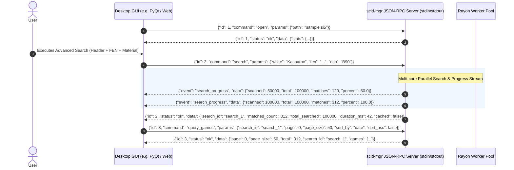

# 🔌 JSON-RPC Server API & GUI Integration Guide

This guide provides a comprehensive reference for integrating desktop GUIs, web frontends, and automated tooling with the **`scid-mgr`** JSON-RPC server.

---

## 1. IPC Architecture & Protocol Specification

The `scid-mgr` server operates as a child process communicating over standard input (`stdin`) and standard output (`stdout`) using **JSON Lines (NDJSON)**. Every message is a single UTF-8 encoded line terminated by `\n` (LF) or `\r\n` (CRLF).



### Message Types

The server handles two categories of output lines:

1. **RPC Responses** (correlated by integer or string `id`):
   ```json
   {
     "id": 1,
     "status": "ok",
     "data": { ... },
     "error": null
   }
   ```
   Or on failure:
   ```json
   {
     "id": 1,
     "status": "error",
     "data": null,
     "error": "Error description message"
   }
   ```
   Or when a running operation is canceled via `cancel`:
   ```json
   {
     "id": 1,
     "status": "canceled",
     "data": null,
     "error": "Operation canceled by client"
   }
   ```

2. **Asynchronous Streaming Events** (unsolicited notifications without `id`):
   Emitted periodically during long-running tasks to drive progress bars and UI indicators.

   - **`search_progress`** (Multi-threaded CQL / header / material search):
     ```json
     {
       "event": "search_progress",
       "data": {
         "scanned": 125000,
         "total": 500000,
         "matches": 342,
         "percent": 25.0
       }
     }
     ```
   - **`opening_tree_progress`** (Dynamic tree calculations over large databases):
     ```json
     {
       "event": "opening_tree_progress",
       "data": {
         "scanned": 50000,
         "total": 500000,
         "percent": 10.0
       }
     }
     ```
   - **`continuations_progress`** (Dynamic multi-ply continuation line calculation):
     ```json
     {
       "event": "continuations_progress",
       "data": {
         "scanned": 50000,
         "total": 500000,
         "percent": 10.0
       }
     }
     ```
   - **`build_booster_progress`** (Building the `.boost.idx` companion index):
     ```json
     {
       "event": "build_booster_progress",
       "data": {
         "scanned": 500000,
         "total": 3500000,
         "plies": 41200000,
         "percent": 14.28
       }
     }
     ```
   - **`import_progress`** / **`export_progress`** (PGN batch ingestion and extraction).

---

## 2. Command Reference

### 2.1 Database Lifecycle & Management

#### `open`
Opens a database on disk (`.si5`, `.si4`, or `.pgn`). Automatically checks companion indexes (`.boost.idx`, `.pos.idx`, `.tree.idx`, `.hot.idx`, `.feat.idx`) and clears prior search session caches.
- **Request**:
  ```json
  {
    "id": 1,
    "command": "open",
    "params": {
      "path": "C:/chess/databases/Mega2026.si5"
    }
  }
  ```
- **Response**:
  ```json
  {
    "id": 1,
    "status": "ok",
    "data": {
      "has_booster": true,
      "booster_index_status": "valid",
      "booster_index_plies": 420581900,
      "stats": {
        "db_type": "SCID",
        "game_count": 10352410,
        "deleted_count": 0,
        "path": "C:/chess/databases/Mega2026.si5",
        "has_booster": true,
        "booster_index_status": "valid",
        "booster_index_plies": 420581900,
        "pos_index_status": "valid",
        "pos_index_unique_positions": 4120300,
        "tree_index_status": "valid",
        "tree_index_unique_positions": 120500,
        "hot_index_status": "valid",
        "hot_index_nodes": 85400,
        "feat_index_status": "valid",
        "feat_index_features": 47
      }
    }
  }
  ```

#### `save`
Commits all in-memory metadata changes, header updates, and deletion flags to the database index file.
- **Request**: `{"id": 2, "command": "save", "params": {}}`

#### `sort_database` (alias: `sort_db`)
Permanently sorts and compacts a SCID database in-place or writes to a new destination database on disk.
- **Params**:
  - `sort_by`: `"date"` | `"white_elo"` | `"black_elo"` | `"white"` | `"black"` | `"eco"` | `"result"` | `"event"` | `"site"`
  - `sort_asc`: `true` | `false` (default: `true`)
  - `delete_removed`: `boolean` (default: `true`, purges deleted games)
  - `output_path`: `string` (optional; if omitted, sorts in-place)

#### `sort_pgn`
Sorts all games in a source PGN file according to specified criteria and writes them to a new destination PGN file.
- **Params**: `input_path` (optional), `output_path` (`string`), `sort_by` (`string`), `sort_asc` (`boolean`).

#### `import_pgn` / `export_pgn`
Imports or exports games with streaming progress notifications (`import_progress` / `export_progress`).

#### `cancel` (aliases: `stop`, `abort`)
Cancels any currently running long task (such as a multi-threaded CQL/header search, dynamic opening tree scan, dynamic continuations search, or companion index builder).
- **Non-blocking Execution**: The server reads `stdin` continuously on a dedicated asynchronous reader thread. Even while worker threads are executing heavy queries across 10M+ games, sending `{"command": "cancel"}` is processed immediately (< 1 ms).
- **Request**:
  ```json
  {
    "id": 99,
    "command": "cancel",
    "params": {}
  }
  ```
- **Immediate Cancellation Acknowledgment**:
  ```json
  {
    "id": 99,
    "status": "ok",
    "data": {
      "canceled": true,
      "active_task": true
    },
    "error": null
  }
  ```
- **Active Task Result**: The task being aborted immediately stops scanning and returns a canceled response:
  ```json
  {
    "id": 10,
    "status": "canceled",
    "data": null,
    "error": "Operation canceled by client"
  }
  ```

---

### 2.2 Unified Search API

The search API supports two primary patterns:
1. **Unified Multi-Criteria Search** (`search` / `search_games`): Combines headers, exact/partial board positions, material bitboards, and CQL expressions into a single query.
2. **Specialized CQL Query Search** (`search_cql` / `cql_search` / `dsl_search`): Executes pure CQL scripts.

#### `search` (Unified Multi-Criteria Search)
Accepts either a structured JSON filter object, a pure CQL string, or a combination of both. Executes across all CPU cores in parallel and creates a cached `search_id` session for pagination.

- **Request with Multi-Criteria Filter**:
  ```json
  {
    "id": 10,
    "command": "search",
    "params": {
      "player": "Kasparov",
      "white": "Kasparov, Garry",
      "black": "Karpov, Anatoly",
      "eco": "B90",
      "result": "1-0",
      "date": "1985-1995",
      "event": "World Championship",
      "site": "Moscow",
      "fen": "rnbqkbnr/pppppppp/8/8/4P3/8/PPPP1PPP/RNBQKBNR b KQkq e3 0 1",
      "material": {
        "white_queens": [1, 1],
        "black_queens": [0, 0],
        "opposite_bishops": false
      },
      "cql": "piece Q on [d4, e4, d5, e5] and rooks >= 2"
    }
  }
  ```

- **Request with Pure CQL String**:
  ```json
  {
    "id": 11,
    "command": "search",
    "params": {
      "query": "move to _ and white_elo >= 2600"
    }
  }
  ```

- **Response**:
  ```json
  {
    "id": 10,
    "status": "ok",
    "data": {
      "search_id": "search_1",
      "total_searched": 10352410,
      "matched_count": 48,
      "duration_ms": 38,
      "cached": false
    },
    "error": null
  }
  ```

#### `search_cql` (Pure CQL Query Search)
Direct CQL query parsing and execution. Returns syntax errors with line, column, and snippet diagnostics when parsing fails.
- **Request**:
  ```json
  {
    "id": 12,
    "command": "search_cql",
    "params": {
      "query": "queens >= 2 and rooks == 0"
    }
  }
  ```

#### ⚡ Search Booster Auto-Acceleration & Transparent Fallback
Both `search` and `search_cql` automatically take advantage of the companion `.boost.idx` Search Booster file whenever it is available:
- **Instant Acceleration (10x–50x speedup)**: The engine evaluates queries directly over the contiguous 16-bit move stream without unpacking SCID binary game blobs or parsing PGN move text.
- **Supported Capabilities**:
  - Full board position searches (FEN, piece placements)
  - Material filters (piece count ranges, piece differences, bishop color pairing)
  - Square sets, ray attacks, and pawn structures
  - Tactical motifs and piece mobility
  - Board transformations (`shift`, `mirror`, `flip`)
  - Move filters (`move from ... to ...`)
- **Transparent Fallback**:
  If the booster index is missing, or if a game starts from a custom FEN setup (non-standard startpos), or if the query requires multi-ply timeline sequence evaluation (`SearchQuery::Path` / `CqlPath` / `CqlLine`), the search adapter automatically falls back to full move decoding per game. No user action or parameter flag is required.

#### `validate_dsl`
Performs query parsing and static analysis without executing the search.
- **Request**: `{"id": 13, "command": "validate_dsl", "params": {"query": "move from B to _"}}`
- **Response**: `{"id": 13, "status": "ok", "data": {"valid": true}}`

#### `explain_dsl`
Analyzes query AST, expands board symmetry variations, and identifies header-only fast-path eligibility.

---

### 2.3 Querying Games & Virtual Pagination

#### `query_games` (alias: `get_games`)
Retrieves paginated game headers and matching ply indices.
- **Request**:
  ```json
  {
    "id": 20,
    "command": "query_games",
    "params": {
      "search_id": "search_1",
      "page": 0,
      "page_size": 25,
      "sort_by": "white_elo",
      "sort_asc": false
    }
  }
  ```

- **Response**:
  ```json
  {
    "id": 20,
    "status": "ok",
    "data": {
      "page": 0,
      "page_size": 25,
      "total": 48,
      "search_id": "search_1",
      "games": [
        {
          "id": 41209,
          "white": "Kasparov, Garry",
          "black": "Karpov, Anatoly",
          "date": "1985.10.15",
          "result": "1-0",
          "event": "World Championship 31th",
          "site": "Moscow",
          "round": "16",
          "white_elo": 2700,
          "black_elo": 2720,
          "eco": "B90",
          "deleted": false,
          "matching_plies": [24, 38],
          "match_count": 2
        }
      ]
    }
  }
  ```

#### `get_pgn`
Fetches complete standard PGN text for a single game ID.
- **Request**: `{"id": 21, "command": "get_pgn", "params": {"index": 41209}}`

---

### 2.4 Instant Positional & Graph Engines

#### `opening_tree` (alias: `query_tree`)
Sub-millisecond opening explorer for any position (starting board or arbitrary FEN). Supports **single-pass combined computation** of both 1-ply tree moves and multi-ply continuation lines simultaneously.
- **Tree Params**:
  - `fen`: `string` (optional; defaults to starting board)
  - `max_sample_games`: `number` (default: 20; sample game IDs per move)
  - `include_all_game_ids`: `boolean` (optional, default `false`)
  - `use_search_results`: `boolean` (optional; limits tree stats strictly to current active search results)
  - `filter`: `GameFilter` (optional inline metadata filter)
- **Combined Continuation Params** (optional):
  - `include_continuations`: `boolean` (default: `false`; enables single-pass continuation lines calculation)
  - `continuation_depth` / `max_depth`: `number` (default: `8`; half-moves lookahead)
  - `max_lines`: `number` (default: `10`; max variation lines to return)
  - `min_games`: `number` (default: `1`; frequency cutoff)
  - `min_percentage`: `number` (default: `0.0`; branch percentage threshold)
- **Response**: Returns standard tree stats (`moves`, `white_wins`, `avg_white_elo`, etc.) and when requested, `continuations: [ { "formatted": "1... e5 2. Nf3 Nc6", "games": 18200, ... } ]`.
- **Streaming Progress Event**: When performing dynamic tree scans over large databases without pre-aggregated index, emits:
  ```json
  {
    "event": "opening_tree_progress",
    "data": {
      "scanned": 250000,
      "total": 1000000,
      "percent": 25.0
    }
  }
  ```
- **Cancellation**: Can be canceled mid-execution via `{"command": "cancel"}`.

#### `search_position`
Accelerated Zobrist binary position search (< 0.1 ms when `.pos.idx` is present). Returns a `search_id` for pagination via `query_games`.

#### `search_material`
Hardware bitboard material searches (e.g. piece counts, opposite-colored bishops). Returns a `search_id` for pagination via `query_games`.

#### `build_booster_index` (alias: `build_booster`)
Builds the 16-bit Search Booster companion index (`.boost.idx`) across all CPU cores. Emits `build_booster_progress` streaming events and can be canceled at any time via `{"command": "cancel"}`.
- **Request**: `{"id": 30, "command": "build_booster_index", "params": {}}`
- **Streaming Progress Event**:
  ```json
  {
    "event": "build_booster_progress",
    "data": {
      "scanned": 500000,
      "total": 3500000,
      "plies": 41200000,
      "percent": 14.28
    }
  }
  ```
- **Response**:
  ```json
  {
    "id": 30,
    "status": "ok",
    "data": {
      "status": "valid",
      "path": "C:/chess/databases/Mega2026.boost.idx",
      "games_indexed": 3500000,
      "total_plies": 284910200,
      "elapsed_ms": 1240,
      "file_size_bytes": 597820464
    }
  }
  ```

#### `check_booster_index`
Checks if the database has a valid, up-to-date Search Booster companion index.
- **Request**: `{"id": 31, "command": "check_booster_index", "params": {}}`
- **Response**:
  ```json
  {
    "id": 31,
    "status": "ok",
    "data": {
      "status": "valid", // "valid" | "outdated" | "missing"
      "path": "C:/chess/databases/Mega2026.boost.idx",
      "games_indexed": 3500000,
      "total_plies": 284910200,
      "file_size_bytes": 597820464
    }
  }
  ```

#### `continuations` & `build_continuations`
Explores common multi-move continuation branches using `.boost.idx` or `.hot.idx` DAG graph. Emits `continuations_progress` events during dynamic scanning and supports instant cancellation via `{"command": "cancel"}`.
- **Params**:
  - `fen`: `string` (optional FEN position; defaults to starting board)
  - `max_depth`: `number` (default: `8`; half-moves lookahead)
  - `max_lines`: `number` (default: `10`; max variation lines to return)
  - `min_games`: `number` (default: `1`; frequency cutoff)
  - `min_percentage`: `number` (default: `0.0`; branch percentage threshold)
  - `use_search_results`: `boolean` (optional; if `true`, calculates continuation lines strictly for the active search session / filtered subset)
  - `game_ids`: `number[]` (optional; calculates continuation lines strictly for an explicit array of game IDs)
  - `filter`: `GameFilter` (optional inline metadata filter)
  - `include_tree`: `boolean` (optional, default: `false`)
- **Filtered Evaluation Routing**:
  When `use_search_results: true`, `filter`, or `game_ids` are supplied, the static global graph (`.hot.idx`) is automatically bypassed, and candidate game IDs are evaluated dynamically via the Search Booster (`.boost.idx`) in parallel.
- **Streaming Progress Event**:
  ```json
  {
    "event": "continuations_progress",
    "data": {
      "scanned": 250000,
      "total": 1000000,
      "percent": 25.0
    }
  }
  ```

#### `endgames` & `build_endgames`
47-feature endgame taxonomy analytics using `.feat.idx` companion index. Supports full-database analysis, FEN position matches, or strictly filtered search results via `use_search_results: true`, `filter: {...}`, or explicit `game_ids: [...]`.

---

### 2.5 Filtered Opening Explorer & Player Repertoires (`use_search_results`)

You can generate **filtered opening explorer statistics** (e.g. White repertoire for Magnus Carlsen, games > 2600 Elo, or specific tournament games) by linking search queries to the opening tree or continuations engine:

1. **Step 1 — Execute a Filter / Search**:
   Run any search query (e.g., `search_header` with `{"white": "Carlsen, M"}` or `search_cql`). The server returns a `search_id` and caches the matching game IDs.
2. **Step 2 — Request Tree / Continuations with `use_search_results: true`**:
   ```json
   {
     "id": 40,
     "command": "opening_tree",
     "params": {
       "fen": "rnbqkbnr/pppppppp/8/8/4P3/8/PPPP1PPP/RNBQKBNR b KQkq - 0 1",
       "use_search_results": true,
       "include_continuations": true
     }
   }
   ```
3. **Execution Mechanism**:
   - **Automatic Bypass**: The engine automatically detects the active filter and bypasses the static `.hot.idx` precalculated global database totals.
   - **Search Booster Dynamic Evaluation**: The engine feeds the filtered list of `game_ids` directly into the Search Booster (`.boost.idx`).
   - **Parallel Calculation**: The booster evaluates only those candidate games across all CPU cores in parallel, returning exact move distributions, win/draw/loss counts, and continuation lines for the filtered player or query subset.
   - **File Fallback**: If no booster file is present, it scans the filtered games directly from the database file.

---

### 2.5 💡 GUI Best Practice: Search Booster Missing/Outdated Alerts

When opening a database:
1. Check `data.booster_index_status` from the `open` response (or call `check_booster_index`).
2. If `booster_index_status != "valid"` (i.e. `"missing"` or `"outdated"`):
   - Display an alert/banner or prompt in the GUI:  
     *"⚡ High-speed Search Booster index is missing for this database. Build it now for instant opening tree and sub-second position searches?"*
   - On user confirmation, send `{"command": "build_booster_index"}` and wire the `build_booster_progress` event to a `QProgressBar`.

---

## 3. Two-Phase Search Lifecycle & Memory Model

```
┌────────────────────────────────────────────────────────────────────────┐
│ Phase 1: Search Initiation (search / search_cql / search_position)     │
│ ────────────────────────────────────────────────────────────────────── │
│ 1. Client submits filter criteria or CQL string                        │
│ 2. Server checks Fast Cache (re-used if query & DB unchanged)          │
│ 3. Rayon parallel scan evaluates candidates, emitting progress events  │
│ 4. Results stored in SearchSessionManager with matching_plies vector   │
│ 5. Returns { search_id, matched_count, total_searched, duration_ms }   │
└───────────────────────────────────┬────────────────────────────────────┘
                                    │
                                    ▼
┌────────────────────────────────────────────────────────────────────────┐
│ Phase 2: Paginated View Navigation (query_games)                       │
│ ────────────────────────────────────────────────────────────────────── │
│ 1. Client requests { search_id, page, page_size, sort_by, sort_asc }  │
│ 2. Server sorts internal IDs/plies on first sort request (cached)      │
│ 3. Slices requested window (e.g. items 0..50)                          │
│ 4. Resolves metadata from SCID index / PGN in RAM                      │
│ 5. Emits { page, page_size, total, games: [ { ..., matching_plies } ]}│
└────────────────────────────────────────────────────────────────────────┘
```

### Navigating Matching Plies in the GUI

When a search matches internal positions within games (position search, piece maneuvers, CQL criteria), each game in the `query_games` result contains:
- `matching_plies`: `[ply1, ply2, ...]` (0-indexed half-move count from the start of the game).
- `match_count`: Number of occurrences in the game.

**GUI Workflow:**
1. When the user selects a game from the search results table, inspect `game.matching_plies`.
2. If `matching_plies` is non-empty, auto-advance the board cursor to `matching_plies[0]`.
3. Provide "Next Match" (`>`) and "Previous Match" (`<`) toolbar buttons to step through `matching_plies[1..n]`.

---

## 4. Python / Qt GUI Integration Reference

Below is a complete reference client implementation using Python, `QThread`, and `PyQt5`/`PySide`:

```python
import json
import subprocess
import threading
from typing import Callable, Optional, Dict, Any
from PyQt5.QtCore import QObject, pyqtSignal, QThread

class ScidRpcClient(QObject):
    response_received = pyqtSignal(int, dict)       # (request_id, response_dict)
    progress_received = pyqtSignal(str, dict)       # (event_name, event_data)
    error_received = pyqtSignal(str)

    def __init__(self, binary_path: str = "scid-mgr.exe"):
        super().__init__()
        self.process = subprocess.Popen(
            [binary_path, "server"],
            stdin=subprocess.PIPE,
            stdout=subprocess.PIPE,
            stderr=subprocess.PIPE,
            text=True,
            bufsize=1
        )
        self._request_counter = 0
        self._lock = threading.Lock()
        
        # Start background reader thread
        self.reader_thread = threading.Thread(target=self._read_loop, daemon=True)
        self.reader_thread.start()

    def _read_loop(self):
        while True:
            line = self.process.stdout.readline()
            if not line:
                break
            line = line.strip()
            if not line:
                continue
            try:
                msg = json.loads(line)
                if "event" in msg:
                    self.progress_received.emit(msg["event"], msg.get("data", {}))
                elif "id" in msg:
                    self.response_received.emit(msg["id"], msg)
            except Exception as e:
                self.error_received.emit(f"JSON Parse Error: {e}")

    def send_command(self, command: str, params: Optional[Dict[str, Any]] = None) -> int:
        with self._lock:
            self._request_counter += 1
            req_id = self._request_counter
            payload = {
                "id": req_id,
                "command": command,
                "params": params or {}
            }
            line = json.dumps(payload) + "\n"
            self.process.stdin.write(line)
            self.process.stdin.flush()
            return req_id

    # Convenience API helpers
    def open_database(self, file_path: str) -> int:
        return self.send_command("open", {"path": file_path})

    def unified_search(self, filter_params: Dict[str, Any]) -> int:
        """Runs multi-criteria search (combines headers, FEN, material, CQL)."""
        return self.send_command("search", filter_params)

    def query_page(self, search_id: str, page: int = 0, page_size: int = 50,
                   sort_by: str = "date", sort_asc: bool = True) -> int:
        """Paginates and sorts results from a search session."""
        return self.send_command("query_games", {
            "search_id": search_id,
            "page": page,
            "page_size": page_size,
            "sort_by": sort_by,
            "sort_asc": sort_asc
        })

    def cancel_current_task(self) -> int:
        """Immediately aborts any running search, tree scan, or index build."""
        return self.send_command("cancel")

    def close(self):
        try:
            self.process.terminate()
        except Exception:
            pass
```

---

## 5. Summary of Endpoint Mappings

| Command Aliases | Handler Function | Primary Use Case |
| :--- | :--- | :--- |
| `cancel`, `stop`, `abort` | Internal Reader Flag | Instantly cancels running search, dynamic tree calculation, or index build |
| `search`, `search_games`, `filter_search` | `handle_search` | Unified search (structured JSON filter or raw CQL string) |
| `search_cql`, `cql_search`, `search_query`, `query_search`, `dsl_search` | `handle_cql_search` | Pure CQL script / DSL execution with auto-booster acceleration |
| `query_games`, `get_games` | `handle_query_games` | Paginated slicing and sorting of database or `search_id` results |
| `search_position` | `handle_search_position` | Instant Zobrist binary position search |
| `search_material` | `handle_search_material` | Bitboard material and bishop color search |
| `opening_tree`, `query_tree` | `handle_opening_tree` | Dynamic opening tree explorer (with `opening_tree_progress`) |
| `continuations` | `handle_continuations` | Common continuations DAG explorer (with `continuations_progress`) |
| `build_booster_index`, `build_booster` | `handle_build_booster` | Multi-threaded 16-bit Search Booster index generation |
| `check_booster_index`, `booster_status` | `handle_check_booster` | Verifies existence and validity of companion `.boost.idx` |
| `endgames`, `build_endgames` | `handle_endgames` / `handle_build_endgames` | 47-feature endgame distribution & feature matching |
| `validate_dsl` | `handle_validate_dsl` | Query syntax validation and AST checking |
| `explain_dsl` | `handle_explain_dsl` | Query structure and symmetry explanation |

