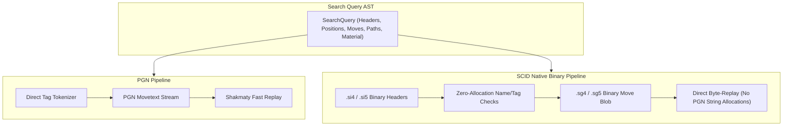

# 🔍 SCID-MGR Search Engine Specification & Reference

The `scid-mgr` search engine is a modular, high-performance query evaluator designed to express complex chess pattern searches—ranging from metadata header filters and move sequences to geometric piece placements and hardware-accelerated bitboard material queries.

Inspired by CQL (Chess Query Language) concepts, the engine provides an expressive Abstract Syntax Tree (AST) while remaining lightweight, decoupled, and optimized for both **PGN** and **native SCID (`.si4`/`.sg4`, `.si5`/`.sg5`)** database formats.

---

## ⚡ Native Dual-Format Architecture: PGN & SCID Direct

A core design principle of `scid-mgr` is **zero intermediate conversion**:



- **PGN Pipeline**: Direct header extraction and zero-copy movetext streaming without regular-expression bottlenecks.
- **SCID Pipeline**: Evaluates metadata directly from fixed-size binary header records (`.si4`/`.si5`) and name tables (`.sn4`/`.sn5`), then decodes game moves straight from `.sg4`/`.sg5` binary move streams into board states. This avoids generating intermediate PGN text, saving massive CPU time and memory allocations.
- **Index Acceleration**: Queries containing position or material patterns can leverage `.pos.idx` / `.scidpos5` inverted bitboard indexes to prune 99%+ of non-matching games before timeline evaluation.

---

## 🧩 Query Keywords & AST Reference

All queries are built from the [`SearchQuery`](file:///C:/Users/ASUS/programming/qt_programs/chess/scid-mgr/src/search/query.rs#L220-L260) enum and can be nested arbitrarily using boolean combinators.

### 1. Header Predicates (`HeaderPredicate`)

Matches PGN tags or SCID header metadata with configurable comparison operators and case sensitivity.

| Keyword / Variant | Description | Example |
| :--- | :--- | :--- |
| `White` | White player name | `HeaderPredicate::White { name: "Kasparov".into(), op: ComparisonOp::Contains, case_sensitive: false }` |
| `Black` | Black player name | `HeaderPredicate::Black { name: "Carlsen".into(), op: ComparisonOp::Contains, case_sensitive: false }` |
| `Player` | Matches either White or Black | `HeaderPredicate::Player { name: "Morphy".into(), op: ComparisonOp::Contains, case_sensitive: false }` |
| `WhiteElo` | White Elo rating | `HeaderPredicate::WhiteElo { op: ComparisonOp::GreaterThanOrEqual, value: 2700 }` |
| `BlackElo` | Black Elo rating | `HeaderPredicate::BlackElo { op: ComparisonOp::GreaterThanOrEqual, value: 2700 }` |
| `AnyElo` | Either player's Elo rating | `HeaderPredicate::AnyElo { op: ComparisonOp::GreaterThanOrEqual, value: 2800 }` |
| `AvgElo` | Average Elo of both players | `HeaderPredicate::AvgElo { op: ComparisonOp::GreaterThanOrEqual, value: 2650 }` |
| `EloDiff` | Difference `\|WhiteElo - BlackElo\|` | `HeaderPredicate::EloDiff { op: ComparisonOp::GreaterThanOrEqual, value: 200, absolute: true }` |
| `Result` | Game outcome (`"1-0"`, `"0-1"`, `"1/2-1/2"`) | `HeaderPredicate::Result { expected: "1-0".into() }` |
| `Eco` | ECO opening code prefix or exact code | `HeaderPredicate::Eco { code: "B88".into(), op: ComparisonOp::StartsWith }` |
| `Date` | Date or year range | `HeaderPredicate::Date { op: ComparisonOp::GreaterThanOrEqual, value: "2000".into() }` |
| `Event` | Tournament or match name | `HeaderPredicate::Event { name: "World Championship".into(), op: ComparisonOp::Contains, case_sensitive: false }` |
| `Site` | Location of the game | `HeaderPredicate::Site { name: "Wijk aan Zee".into(), op: ComparisonOp::Contains, case_sensitive: false }` |
| `Tag` / `Custom` / `Header` | Arbitrary custom metadata tags or SCID extra tags | `HeaderPredicate::Tag { name: "Annotator".into(), op: ComparisonOp::Contains, value: "Nunn".into(), case_sensitive: false }` |

#### Custom Tag & Extra Header Search:
Query any standard or custom header tag across both PGN and SCID binary databases using `tag` or `header`:
```text
tag "TimeControl" == "300+0"
header "Annotator" contains "Stockfish"
header "Annotator" has "Nunn"
tag "Source" matches "^ICC.*"
tag "FEN" : "8/8"
header "Variant" != "Standard"
```
- **PGN Databases**: Matches against any standard or custom PGN header tag.
- **SCID Binary Databases**: Automatically decodes both standard SCID extra tags (`EventDate`, `Annotator`, `Source`, `TimeControl`, etc.) and user-defined custom tag key-value pairs stored in `.sg4`/`.sg5` blobs.

#### Regular Expression Syntax in CQLite DSL:
You can match player names, events, sites, and custom headers using the regex operator `~` or the `regex(...)` function:
```text
player ~ "Kasparov|Morphy"
white ~ "(?i)alexander.*"
black:regex("Duke Karl|Count Isouard")
event ~ "World (Championship|Cup) .*"
header "Annotator" ~ "Stockfish (16|17)"
```

---

### 2. Position Patterns (`PositionPattern`)

Evaluates board states across game moves.

| Keyword / Variant | Description | Example |
| :--- | :--- | :--- |
| `ExactFen` | Full FEN or Wildcard FEN match | `PositionPattern::ExactFen("r1bqk2r/pppp1ppp/...".into())` or `fen "*/*/*/*ppA*/*/*/*/*"` |
| `PiecePlacement` | Visual piece placement with wildcard support | `PositionPattern::PiecePlacement("r1b*k2r/*".into())` |
| `ZobristHash` | 64-bit Zobrist position hash | `PositionPattern::ZobristHash(0x123456789abcdef0)` |
| `Squares` | Specific piece or color on given squares | `PositionPattern::Squares(map)` (e.g. `Square::D8 -> White Rook`) |
| `PieceCount` | Board count for a specific piece or role | `PositionPattern::PieceCount { content: SquareContent::Piece(White Queen), op: ComparisonOp::Equal, count: 0 }` |
| `Turn` | Color whose turn it is to move (`wtm`, `btm`, `turn white`, `turn black`) | `PositionPattern::Turn(Color::White)` |
| `LegalMoves` | Number of legal moves available in the position | `legal == 0` (checkmate/stalemate), `legal count >= 20` |
| `Castling` | Specific castling availability flags | `PositionPattern::Castling { color: Color::White, kingside: Some(true), queenside: None }` |
| `BoardState` | Tactical states: Check, Checkmate, Stalemate | `PositionPattern::BoardState { is_check: None, is_checkmate: Some(true), is_stalemate: None }` |
| `Attack` | Piece on `from` is attacking `to` square | `PositionPattern::Attack { from: Square::G5, to: Square::F6 }` |
| `IsAttacked` | A specific square is attacked by a color | `PositionPattern::IsAttacked { square: Square::E4, by_color: Color::Black }` |

#### FEN & Position Query Keywords:
- **`fen`**, **`position`**, **`pos`**, **`board`**, **`placement`** can all be used interchangeably to search positions.
- **Turn Keywords**: `wtm` (*White to move*), `btm` (*Black to move*), `turn white`, `turn black`.
- **Legal Move Counts**:
  - `legal == 0` / `legal count == 0`: 0 legal moves available.
  - `check and legal == 0`: Checkmate.
  - `not check and legal == 0`: Stalemate.
  - `legal >= 25`: Positions with high branching factor.
- **Wildcards (`*`, `?`, `A`, `a`)**:
  - `*` for an entire rank matches any configuration on that rank (e.g., `fen "*/*/*/*/4k3/*/*/*"`).
  - `*` within a rank matches any sequence of pieces/empty squares (e.g., `fen "*R*/*"` matches White Rook on 8th rank).
  - `A` matches **any White piece** on that square (e.g., `fen "*/*/*/*ppA*/*/*/*/*"`).
  - `a` matches **any Black piece** on that square.
  - `?` or `.` matches any single square (piece or empty).
  - Partial FEN ranks automatically wildcard unspecified ranks.

#### Piece Notation & Standard Casing:
- **Uppercase letters (`P, N, B, R, Q, K`)** represent **White pieces**.
- **Lowercase letters (`p, n, b, r, q, k`)** represent **Black pieces**.
- **Any White / Black piece**: `A` (any White piece) and `a` (any Black piece).
- **Global keywords**: `white_pieces` (alias `A`), `black_pieces` (alias `a`), `any_piece`, `occupied`, `empty`.

#### Bracketed Piece Group Counts:
You can group piece symbols inside brackets `[...] <op> <count>` to query the **sum of counts** of all piece types inside the brackets:
- `[Qq] == 0`: Exactly 0 queens on the board for both sides (queenless game/position).
- `[RBN] == 2`: Exactly 2 White minor/major pieces total (e.g. 1 Rook + 1 Knight, or 2 Bishops).
- `[KkQq] == 2`: Exactly 2 total kings and queens on the board. Since kings always exist ($1+1=2$), this means **only kings, no queens**.
- `[Qq] == 4`: Exactly 4 total queens on the board (e.g. 2 White + 2 Black, 3 White + 1 Black, etc.).
- `[RBNrbn] >= 6`: Total number of minor and major pieces (excluding Queens/Kings) is at least 6.

```text
piece N on c3 and piece n on f6
piece Q on [d1, e1] and piece q on e8
A == 2 and R == 1 and a == 1
[Qq] == 0
[RBN] == 2
white_pieces count >= 8
black_pieces on [d7, e7]
empty on e4
wtm and check and legal == 0
```

---

### 3. Move & Path Sequence Patterns (`MovePattern` & `PathPattern`)

Matches individual moves, move attributes, legal move predicates, wildcard piece moves, or multi-move tactical and strategic lines.

| Keyword / Field | Type | Description |
| :--- | :--- | :--- |
| `san` | `Option<String>` | Standard Algebraic Notation (e.g. `"e4"`, `"Nf3"`, `"exd5"`, `"O-O"`, `"Qh5#"`) |
| `uci` | `Option<String>` | UCI coordinate move string (e.g. `"e2e4"`, `"g1f3"`, `"e7e8q"`) |
| `from` / `to` | `Option<Vec<Square>>`, `Option<Vec<SquareContent>>` | Source / destination square OR piece filters (e.g. `move from B to R`, `move from [B, N] to [r, q]`, `move from A to a`, `move from e2 to e4`, `move from [e1, e8] to [c1, g1, c8, g8]`, `move to [d8]`) |
| `role` / `color` | `Option<Role>`, `Option<Color>` | Moving piece type and color (e.g. `move piece Q`, `move piece k`) |
| `is_capture` | `Option<bool>` | Requires move to be a capture (`move capture`, `move is_capture`) |
| `promotion` | `Option<Role>` | Promotion piece requirement (e.g. `Role::Queen`) |
| `is_check` | `Option<bool>` | Requires move to deliver check (`move check`) |
| `is_legal` / `count_predicate` | `bool`, `Option<(Op, usize)>` | Filters candidate legal moves in the position (`move legal count == 0`, `move legal from [d1..d8] >= 1`) |

#### Wildcard Move & Promotion Patterns:
You can express flexible move shapes and promotions using wildcard notation:
- **`A--`**: Any White piece moves anywhere.
- **`a--`**: Any Black piece moves anywhere.
- **`_--` / `_` / `--`**: Any move by any piece.
- **`R--` / `r--`**: A White / Black Rook moves anywhere.
- **`--=R`**: Any move that promotes to a White Rook.
- **`--="RBN"` / `_--=[rbn]`**: Any underpromotion to a specified set of pieces.
- **`pxN=q`**: A Black pawn captures a White knight and promotes to a Black queen.
- **`px=q`**: A Black pawn captures any piece and promotes to a Black queen.
- **`Px=Q` / `Pxn=Q`**: A White pawn captures and promotes to a White queen.
- **Castling & En Passant**: Castling moves (`O-O`, `O-O-O`) and en passant captures are fully handled in path and move searches.

#### Move Filter Syntax Examples:
```text
move from B to R
move from [B, N] to [r, q]
move from A to a
move A--
move --=R
move pxN=q
move from e2 to e4
move from [e1, e8] to [c1, g1, c8, g8]
move piece Q to [d8, e8]
move capture
move check
move legal count == 0
move legal from [e1, e8] to [c1, g1]
```

#### Path Matching Options (`PathPattern`):
- **`consecutive: true`**: Moves must occur consecutively ply-for-ply (e.g., opening lines `1. e4 e5 2. Nf3 d6`).
- **`consecutive: false` (Themed / Gapped Paths)**: Moves must occur in order, with up to `max_gap_plies` between them (e.g., `e4` followed later by `Bg5` and eventually `Rd8#`).
- **`start_ply_range`**: Restricts where the sequence can begin (e.g., `0..2` for move 1).

#### CQL 6.2 Path & Turnstile Sequences (`cqlpath { ... }` / `turnstile { ... }` / `sequence { ... }`):
In addition to standard `path [...]`, the engine supports full CQL 6.2 `cqlpath` sequences interleaving **Move Constituents** (which advance the ply timeline) and **Positional Filter Constituents** (which assert board states at the current position without advancing the move index):
- **SAN Moves with Suffixes**: `cqlpath { Qb8+ Nxb8 Rd8# }`
- **Keyword & Filter Checkers**: `cqlpath { e4 not check e5 }`, `cqlpath { Qb8 check Nxb8 Rd8 mate }`
- **Interleaved Positional Filters**: `sequence { e4 { [p] on e7 } e5 { [p] on e5 } }`
- **Repetitions & Chains**: `turnstile { (Bxh7+ kxh7)+ }`, `(e4 e5){1, 3}`

#### Modern CQLi `line` Filter (`line -->` / `line <--` / `cqlline`):
Searches for sequential position transitions along directional arrows (`-->` forward or `<--` backward look-behind):
- **Canonical Arrow Chains**: `line --> check --> move previous capture --> mate`
- **Check Streaks & Ranges**: `line 5 100 nestban --> check+`
- **Backward Look-Behind**: `mate and line lastposition <-- check* <-- Queen`
- **Group Chains**: `line --> ( check --> move previous capture )+`
- **Modifiers**: `firstmatch`, `lastposition`, `nestban`, `singlecolor`, `primary`

---

### 4. Pawn Structure Predicates (`PawnPredicate`)

Hardware bitboard-accelerated evaluations for pawn formations, weaknesses, and endgame assets:

| Keyword / Variant | Description | Example |
| :--- | :--- | :--- |
| `PassedPawns` | Count of passed pawns for a color | `PawnPredicate::PassedPawns { color: Color::White, op: ComparisonOp::GreaterThanOrEqual, count: 1 }` |
| `IsolatedPawns` | Count of isolated pawns (no friendly pawns on adjacent files) | `PawnPredicate::IsolatedPawns { color: Color::Black, op: ComparisonOp::Equal, count: 0 }` |
| `DoubledPawns` | Count of doubled / tripled pawns on the same file | `PawnPredicate::DoubledPawns { color: Color::White, op: ComparisonOp::Equal, count: 0 }` |
| `BackwardPawns` | Count of backward pawns behind adjacent friendly pawns | `PawnPredicate::BackwardPawns { color: Color::Black, op: ComparisonOp::GreaterThanOrEqual, count: 1 }` |
| `PawnIslands` | Number of distinct contiguous pawn file clusters | `PawnPredicate::PawnIslands { color: Color::Black, op: ComparisonOp::LessThanOrEqual, count: 2 }` |

---

### 5. Tactical & Geometric Motifs (`TacticalPredicate`)

Evaluates attack rays, piece relationships, outposts, and spatial geometry:

| Keyword / Variant | Description | Example |
| :--- | :--- | :--- |
| `Pin` | Pinner attacks Target through Pinned piece | `pin [B, n, k]`, `pin from B to k through n`, `pin from bishop to queen through knight` |
| `Fork` | Single attacker simultaneously attacks 2+ enemy targets | `fork [wn, bk, bq]` (White Knight forks King and Queen) |
| `DiscoveredAttack` | Attack ray unmasked by a moving piece | `discovered_attack white`, `discovered_check white` |
| `Skewer` | Attacker attacks Front piece, exposing Rear piece | `skewer [Q, k, r]`, `skewer from Q to r through k` |
| `TrappedPiece` | Piece with 0 safe/legal escape squares | `trapped [bq]` |
| `Outpost` | Piece entrenched on 4th..6th rank protected by friendly pawn | `outpost [wn, d5]` |
| `RookOnSeventh` | Rook on the 7th rank (rank 7 for White, rank 2 for Black) | `rook_7th white` |
| `OpenFile` | Open or semi-open file | `open_file [d]`, `semi_open [c, white]` |
| `Distance` | Chebyshev (King step) distance between squares/pieces | `distance(wk, bk) <= 2` |

---

### 6. Hardware Bitboard Material Predicates (`MaterialPredicate`)

Performs instant piece count, point difference, and endgame structure checks.

| Field | Description |
| :--- | :--- |
| `white_pawns` .. `black_queens` | Exact piece counts for each piece type |
| `material_difference` | `(ComparisonOp, i32)`: Difference `White Points - Black Points` (P=1, N=3, B=3, R=5, Q=9) |
| `opposite_bishops` | `Some(true)`: Exactly 1 light-squared and 1 dark-squared bishop of opposite colors |
| `same_colored_bishops` | `Some(true)`: Both players have bishops on the same square color |

---

### 6.1. Square Sets, Diagonals, and Light/Dark Modifiers

The engine supports `light` and `dark` as **prefix modifiers** before **any piece**, piece group, or piece bracket list, as well as dynamic square ranges and diagonal expansions:

#### A. Prefix Modifiers on Any Piece or Group:
You can place `light` or `dark` directly before any piece role, symbol, color group, or bracketed piece list:
- **Specific Pieces**: `dark queen`, `light queen`, `dark bishop`, `light knight`, `dark rook`, `light pawn`, `dark king`.
- **Piece Symbols**: `dark Q`, `light Q`, `dark q`, `light q`, `dark B`, `light B`, `dark b`, `light b`, `dark N`, `light n`.
- **Piece Groups / Sets**: `light white_pieces`, `dark white_pieces`, `light black_pieces`, `dark black_pieces`, `dark pieces`, `light occupied`, `dark empty`.
- **Bracketed Lists**: `dark [B, b]`, `light [Q, R]`, `dark [N, n]`.
- **Counts & Placement**:
  - `dark queen` *(checks if at least 1 queen is on a dark square)*
  - `dark queen count >= 2` / `dark queen >= 2` / `dark queen == 1` *(counts queens on dark squares)*
  - `light white_pieces >= 6` *(counts White pieces on light squares)*
  - `dark white_pieces count >= 4` *(counts White pieces on dark squares)*
  - `dark empty >= 16` *(checks empty dark squares count)*
  - `dark queen on [d1..d8]` *(intersects square range with dark squares)*
  - `piece dark queen` / `piece light B`

#### B. Square Sets and Geometric Expansions:
| Square Set / Range | Syntax Example | Description |
| :--- | :--- | :--- |
| **Light Squares** | `piece B on light`, `piece [B, b] on [light]` | Matches all 32 light squares (`Bitboard::LIGHT_SQUARES`). Also accepts `light_squares`. |
| **Dark Squares** | `piece B on dark`, `piece [B, b] on [dark]` | Matches all 32 dark squares (`Bitboard::DARK_SQUARES`). Also accepts `dark_squares`. |
| **Diagonals** | `piece B on [a1..h8]`, `piece b on [a8..h1]` | Expands diagonal rays between endpoints. |
| **Rank/File Blocks** | `piece K on [a1-h2]`, `piece K on [a-h1-2]` | Expands 2D rectangular square regions. |
| **Flank Files** | `piece R on [a1-a8, h1-h8]` | Compound comma-separated ranges. |

---

### 6.2. First-Class Square Set Algebra & Bitboard Engine

CQLite treats square collections, piece placements, and attack geometries as **first-class square sets** evaluating directly to 64-bit hardware bitboards (`shakmaty::Bitboard`):

#### A. Set Expressions & Hardware Operations
| Operation | Syntax | Bitboard Code | Description |
| :--- | :--- | :--- | :--- |
| **Union** | `A \| B` | `A \| B` | Combines pieces or zones $\rightarrow$ `(N \| B) [b5, g5] >= 2` |
| **Difference** | `A \ B` or `A - B` | `A & !B` | Excludes subsets $\rightarrow$ `(occupied \ [e4, d4]) >= 30` |
| **Intersection** | `A & B` or `A B` | `A & B` | Overlap $\rightarrow$ `B & [c1, f1]` or `B [c1, f1]` |
| **Complement** | `~A` or `!A` | `!A` | Entire 64-square bitboard inversion $\rightarrow$ `~occupied >= 32` |
| **Attacks** | `attacks(attacker, target)` | `atk_bb attacks & tgt_bb` | Target squares attacked by attacker $\rightarrow$ `attacks(R, k) >= 2` |
| **Attackers** | `attackers(attacker, target)` | `atk_sqs attacking tgt_bb` | Attacker pieces targeting target set $\rightarrow$ `attackers(white, e5) >= 2` |
| **Ray** | `ray(direction, origin)` | `expand_ray(dir, orig_bb)` | Directional rays from origin $\rightarrow$ `ray(diagonal, [c1, f1])` |
| **Between** | `between(from, to)` | `between_sqs(from, to)` | Squares strictly between two sets $\rightarrow$ `between(k, q) & occupied == 0` |

#### B. Dual-Nature Truthiness & Set-to-Set Comparisons
- **Boolean Context**: Evaluates to `true` if the resulting square set is non-empty (`!set.is_empty()`), e.g., `B [c4, g5]` or `attacks(n, K) & ~occupied`.
- **Numeric Count Comparisons**: Direct evaluation with integer literals, e.g., `attacks(R, k) >= 2`, `B [c4, g5] == 2`.
- **Dynamic Set Comparisons**: Compares the size of two dynamic square set expressions against each other, e.g., `attacks(white_pieces, [d1..d8]) > attacks(black_pieces, [d1..d8])` (spatial file control dominance).

---

### 7. Composite Boolean Combinators & Scoping

| Combinator | Description |
| :--- | :--- |
| `SearchQuery::And(Vec<SearchQuery>)` | All conditions must match |
| `SearchQuery::Or(Vec<SearchQuery>)` | At least one condition must match |
| `SearchQuery::Not(Box<SearchQuery>)` | Condition must NOT match |
| `SearchQuery::PlyRange { range, query }` | Restricts evaluation to specific plies (e.g. `0..20` for opening) |
| `SearchQuery::Occurrences { min, max, query }` | Requires pattern to occur between `min` and `max` times |

---

## 📜 Human-Friendly Query DSL (CQL-Lite Syntax)

The engine includes a text query parser [`QueryParser`](file:///C:/Users/ASUS/programming/qt_programs/chess/scid-mgr/src/search/parser.rs) that allows users and GUIs to express queries in clean, readable text without writing raw AST code:

```rust
use scid_mgr::search::{GameSearchEvaluator, QueryParser};

let dsl = r#"
    cql (
        player "Kasparov"
        elo >= 2750
        eco: "B88"
        passedpawns black >= 1
        line [e4 d6 d4 Nf6]
    )
"#;

let query = QueryParser::parse_str(dsl).expect("Valid query syntax");
let result = GameSearchEvaluator::evaluate_pgn(&query, pgn_game_str);
```

### DSL Keyword Quick Reference:

- **Headers & Regex**: `player "Kasparov"`, `player ~ "Kasp.*"`, `player: regex("^Paul\\s+Morphy$")`, `white "Morphy"`, `black "Topalov"`, `elo >= 2700`, `whiteelo >= 2800`, `result "1-0"`, `eco "B88"`, `date >= "2000"`, `site "Paris"`, `event "World Championship"`, `tag "TimeControl" == "300+0"`, `header "Annotator" contains "Stockfish"`.
- **Board & Position**: `wtm` (*White to move*), `btm` (*Black to move*), `turn white`, `turn black`, `check`, `mate` / `checkmate`, `stalemate`, `legal == 0`, `legal >= 20`, `check and legal == 0`, `ply == 10`, `ply <= 20`, `ply 1..20`, `movenumber == 10`, `movenumber <= 5`, `R on d8`, `R == 1`, `r == 0`, `[Qq] == 0`, `[RBN] == 2`, `[KkQq] == 2`, `A == 2 and R == 1 and a == 1`, `white_pieces == 2 and R == 1 black_pieces == 1`, `white_pieces [e4, d4] >= 2`, `empty [e5, d5]`, `empty on e4`, `not empty on e4`, `fen "r1bqk2r/pppp1ppp/2n2n2/*/*/*/*/*"`, `fen "*/*/*/*ppA*/*/*/*/*"`.
- **Light / Dark Modifiers & Pieces**: `dark queen`, `light queen`, `dark [B, b] >= 1`, `light white_pieces >= 6`, `dark white_pieces count >= 4`, `dark empty >= 16`, `dark queen on [d1..d8]`, `light B`, `dark b`, `light bishop`.
- **Move & Legal Move Filters**: `move from B to r`, `move from [B, N] to [r, q]`, `move from A to a`, `move A--`, `move --=R`, `move pxN=q`, `move from e2 to e4`, `move from [e1, e8] to [c1, g1, c8, g8]`, `move piece Q to [d8, e8]`, `move capture`, `move check`, `move legal count == 0`, `move legal from [e1, e8] to [c1, g1]`, `line [e4 e5 Nf3 d6]`, `path [e4 ... Bg5 ... Rd8#]`, `move "Qb8+"`.
- **Power & Material Points**: `white_power > black_power`, `black_power > white_power`, `power >= 78`, `34 >= black_power`, `power_diff >= 3`, `power(white) <= 30`.
- **Pawn Structures**: `passedpawns [white] >= 1`, `isolatedpawns [black] == 0`, `doubledpawns [white] == 0`, `backwardpawns [black] >= 1`, `pawnislands [black] <= 2`.
- **Tactics & Motifs**: `attacks [N, k]`, `pin [B, n, k]`, `pin from B to k through n`, `pin from bishop to queen through knight`, `fork [N, k, q]`, `discovered_attack white`, `skewer [Q, k, r]`, `skewer from Q to r through k`, `trapped [q]`, `outpost [N, d5]`, `distance(K, k) <= 2`.
- **Annotations & Comments**: `comment:"novelty"`, `nag:!`, `nag:??`, `nag:[1, 3]`.
- **Symmetry & Transformations**: `symmetry:horizontal ( ... )`, `symmetry:color ( ... )`, `symmetry:any ( ... )`, `shifthorizontal { ... }`, `shiftvertical { ... }`, `shift { ... }`, `shift:horizontal`, `shift:vertical`, `shift:all`.
- **Endgame & Material**: `opposite_bishops`, `same_colored_bishops`.
- **Square Ranges & Diagonals**: `B on light`, `[B, b] on [dark]`, `B on [a1..h8]`, `K on [a1-h2]`.
- **Logic, Scoping & Multiline Queries**: `and`, `or`, `not`, `!`, parentheses `( ... )`, `ply 0..20 ( ... )`. Multiple lines or statements separated by whitespace/newlines are automatically treated as implicit `and` connectors without needing explicit `and`s.

---

## 💻 Concrete Code Snippets & Usage Examples

### Example 1: Morphy's Opera Game Checkmate (Piece on Square + Checkmate)

Search for games where White delivers checkmate with a Rook on `d8`:

```rust
use scid_mgr::search::*;
use shakmaty::{Color, Piece, Role, Square};
use std::collections::HashMap;

let mut squares = HashMap::new();
squares.insert(Square::D8, SquareContent::Piece(Piece {
    color: Color::White,
    role: Role::Rook,
}));

let query = SearchQuery::And(vec![
    SearchQuery::Position(PositionPattern::Squares(squares)),
    SearchQuery::Position(PositionPattern::BoardState {
        is_check: None,
        is_checkmate: Some(true),
        is_stalemate: None,
    }),
]);

let result = GameSearchEvaluator::evaluate_pgn(&query, pgn_string);
assert!(result.is_match);
println!("Matched plies: {:?}", result.matching_plies);
```

---

### Example 2: Consecutive Opening Line Path Search

Search for games following the Philidor Defense (`1. e4 e5 2. Nf3 d6`):

```rust
use scid_mgr::search::*;

let opening_query = SearchQuery::Path(PathPattern {
    moves: vec![
        MovePattern { san: Some("e4".into()), ..Default::default() },
        MovePattern { san: Some("e5".into()), ..Default::default() },
        MovePattern { san: Some("Nf3".into()), ..Default::default() },
        MovePattern { san: Some("d6".into()), ..Default::default() },
    ],
    consecutive: true,
    max_gap_plies: None,
    start_ply_range: Some(0..2),
});

let result = GameSearchEvaluator::evaluate_pgn(&opening_query, pgn_string);
```

---

### Example 3: Queen Sacrifice Theme (Gapped Path + Piece Count)

Search for games where White played `Qb8+` (check) followed later by checkmate with 0 White Queens on the board:

```rust
use scid_mgr::search::*;
use shakmaty::{Color, Piece, Role};

let queen_sac_query = SearchQuery::And(vec![
    // 1. Move Qb8+
    SearchQuery::Move(MovePattern {
        san: Some("Qb8+".into()),
        ..Default::default()
    }),
    // 2. White has 0 Queens remaining
    SearchQuery::Position(PositionPattern::PieceCount {
        content: SquareContent::Piece(Piece { color: Color::White, role: Role::Queen }),
        op: ComparisonOp::Equal,
        count: 0,
    }),
    // 3. Game ends in checkmate
    SearchQuery::Position(PositionPattern::BoardState {
        is_check: None,
        is_checkmate: Some(true),
        is_stalemate: None,
    }),
]);
```

---

### Example 4: Opposite-Colored Bishop Endgame with Material Difference

Search for endgame positions where White is ahead by at least 2 pawns with opposite-colored bishops:

```rust
use scid_mgr::search::*;

let bishop_endgame_query = SearchQuery::Material(MaterialPredicate {
    white_pawns: None,
    white_knights: Some(0),
    white_bishops: Some(1),
    white_rooks: Some(0),
    white_queens: Some(0),
    black_pawns: None,
    black_knights: Some(0),
    black_bishops: Some(1),
    black_rooks: Some(0),
    black_queens: Some(0),
    material_difference: Some((ComparisonOp::GreaterThanOrEqual, 2)),
    opposite_bishops: Some(true),
    same_colored_bishops: None,
});
```

---

### Example 5: High-Elo Composite Search with Ply Scoping

Search for Kasparov games with White (Elo >= 2800) in Sicilian Defense (`ECO B80..B89`) where a Bishop moves to `g4` during the first 10 plies:

```rust
use scid_mgr::search::*;

let query = SearchQuery::And(vec![
    SearchQuery::Header(HeaderPredicate::White {
        name: "Kasparov".into(),
        op: ComparisonOp::Contains,
        case_sensitive: false,
    }),
    SearchQuery::Header(HeaderPredicate::WhiteElo {
        op: ComparisonOp::GreaterThanOrEqual,
        value: 2800,
    }),
    SearchQuery::Header(HeaderPredicate::Eco {
        code: "B8".into(),
        op: ComparisonOp::StartsWith,
    }),
    SearchQuery::PlyRange {
        range: 0..10,
        query: Box::new(SearchQuery::Move(MovePattern {
            san: Some("Bg4".into()),
            ..Default::default()
        })),
    },
]);
```

---

### Example 6: Tactical Attack and Negation Patterns (e.g. Knight Smothered Themes)

Search for positions where White has mating / checking threats, a Knight attacks the enemy King, and the opponent has not broken out:

```rust
use scid_mgr::search::*;

// Using the CQL-Lite text DSL:
let dsl = r#"
    turn white and
    attacks(N, k) and
    check and
    not attacks(k, empty) and
    black_pieces on g8
"#;

let query = QueryParser::parse_str(dsl).expect("Valid query syntax");
let result = GameSearchEvaluator::evaluate_pgn(&query, pgn_game_str);
```

---

## 🔍 Comparison Operators Reference (`ComparisonOp`)

| Operator | Symbol / Behavior | Applicable Types |
| :--- | :--- | :--- |
| `Equal` | `==` | Numeric (Elo, counts, plies), Exact String |
| `NotEqual` | `!=` | Numeric, String |
| `GreaterThan` | `>` | Numeric |
| `GreaterThanOrEqual` | `>=` | Numeric |
| `LessThan` | `<` | Numeric |
| `LessThanOrEqual` | `<=` | Numeric |
| `Contains` | Substring match | String (Player, Site, Event, Tags) |
| `StartsWith` | Prefix match | String (ECO codes, Dates, Names) |
| `EndsWith` | Suffix match | String |
| `Regex` | Regular expression pattern | String |

---

## 🔄 Position Transformations & Geometric Symmetries (`transform.rs`)

Single positions can be evaluated under 2D board reflections and color inversions:

| Symmetry Mode | Keyword / CQLite DSL | Description |
| :--- | :--- | :--- |
| `HorizontalMirror` | `flip:horizontal ( ... )` | Left-right file mirror ($a \leftrightarrow h, b \leftrightarrow g, c \leftrightarrow f, d \leftrightarrow e$). Useful for queenside/kingside symmetric attacks. |
| `VerticalMirror` | `flip:vertical ( ... )` | Rank mirror ($1 \leftrightarrow 8, 2 \leftrightarrow 7$). |
| `Rotate180` | `flip:rotate ( ... )` | 180-degree board rotation. |
| `ColorInvert` | `flip:color ( ... )` | Inverts piece colors and flips perspective (White $\leftrightarrow$ Black). |
| `AnySpatialSymmetry` | `flip:spatial ( ... )` | Matches if the position matches under any of the 4 spatial transformations. |
| `AnyTotalSymmetry` | `flip:any ( ... )` | Matches if the position matches under any of the 8 total reflections and color inversions. |

### Multi-Square Piece Placement:
Matches if a piece occupies any square from a designated list:
```text
piece wn on [d4, b4, c4]
```

---

## 📝 Comments & NAG Annotations Search (`annotation.rs`)

Queries can filter and extract games by move comments, evaluation remarks, and standard FIDE/PGN Numeric Annotation Glyphs (NAGs):

| Predicate | CQLite Syntax | Description |
| :--- | :--- | :--- |
| `CommentContains` | `comment:"novelty"` | Substring match inside `{...}` move comments. |
| `CommentRegex` | `comment:regex("eval: \\+?[0-9]+")` | Regex match across comments. |
| `Nag` (Single) | `nag:!` or `nag:??` | Matches standard glyphs (`!` good move, `?` mistake, `!!` brilliant, `??` blunder, `!?` interesting, `?!` dubious). |
| `Nag` (Codes) | `nag:[1, 3, 146]` | Matches specific numerical NAG codes. |

---

## 🚀 Native Zero-Copy SCID Binary Search Adapter (`scid_adapter.rs`)

The SCID Search Adapter provides zero intermediate memory allocation scanning directly from memory-mapped `.si4`/`.si5` and `.sg4`/`.sg5` files:

```rust
use scid_mgr::search::{ScidSearchAdapter, QueryParser};

let query = QueryParser::parse_str(r#"white "Kasparov" and passedpawns white >= 1"#)?;

// Multi-threaded parallel chunk scanning across all CPU cores with Rayon:
let results = ScidSearchAdapter::search_parallel(
    &query,
    db.entries(),
    db.names(),
    |entry| db.get_blob(entry).ok(),
);
```

---

## 🛠️ CQLite Language Taxonomy & Language Server Protocol (LSP) Guide

To facilitate future tooling development (e.g. IDE language servers, VS Code syntax extensions, Monaco editor integrations, hover information, diagnostics, and autocompletion), the grammar and keyword structure are classified below.

### 1. Keyword Taxonomy & Semantic Categories

| Category | Keywords | Argument Grammar | LSP Hover / Completion Summary |
| :--- | :--- | :--- | :--- |
| **Headers** | `player`, `white`, `black`, `elo`, `whiteelo`, `blackelo`, `avgelo`, `elodiff`, `result`, `eco`, `date`, `year`, `event`, `site`, `tag`, `header` | `<op> <value>` (e.g. `white ~ "Kasparov"`, `tag "TimeControl" == "300+0"`) | Filters PGN header tags, custom tags, and SCID name/extra tag tables. Supports `~` regex and string operators (`contains`, `has`, `matches`). |
| **Positions** | `fen`, `position`, `pos`, `board`, `placement`, `check`, `mate`, `checkmate`, `stalemate`, `turn`, `wtm`, `btm`, `legal`, `ply`, `movenumber` | `[<op>] <string>` or `<color>` or `<op> <count>` | Matches specific FENs (with `*`, `?`, `A`, `a` wildcards), game state, turn (`wtm`/`btm`), ply (`ply == 10`), move number (`movenumber == 1`), or legal move counts (`legal == 0`). |
| **Squares & Pieces** | `piece`, `square`, `white_pieces`, `black_pieces`, `occupied`, `empty`, `light`, `dark`, `A`, `a`, bare piece symbols (`P,N,B,R,Q,K,p,n,b,r,q,k`), bracketed sums (`[Qq]`, `[RBN]`, `[KkQq]`) | `[<piece>] on/in <sq>`, `<piece> <op> <n>`, `[<pieces>] <op> <n>`, `light <piece>`, `dark <piece>` | Pinpoints pieces by uppercase (`P,N,B,R,Q,K`), lowercase (`p,n,b,r,q,k`), any White/Black piece (`A`/`a`), bracketed group sum counts (e.g. `[Qq] == 0`), light/dark modifiers, and bare counts (e.g. `R == 1`, `A == 2`). |
| **Power & Material** | `white_power`, `black_power`, `power`, `total_power`, `power_diff`, `opposite_bishops`, `same_colored_bishops` | `<op> <val>` or `target1 <op> target2` | Calculates piece power points and bishop endgame color structures. |
| **Pawn Structure** | `passedpawns`, `isolatedpawns`, `doubledpawns`, `backwardpawns`, `pawnislands` | `[<color>] <op> <count>` | Hardware bitboard pawn structure evaluations. |
| **Tactics & Motifs** | `pin`, `fork`, `discovered_attack`, `discovered_check`, `skewer`, `trapped`, `outpost`, `rook_7th`, `open_file`, `semi_open`, `distance` | `[<piece_list>]` or `(<sq/piece>, <sq/piece>) <op> <n>` | Ray tracing, square geometry, and multi-piece relationships. |
| **Annotations** | `comment`, `comment_contains`, `nag` | `<op> <string>` or `<symbol>` or `[<codes>]` | Matches PGN comments and standard NAGs (`!`, `?`, `!!`, `??`, etc.). |
| **Symmetry & Flips**| `symmetry`, `flip` | `<mode> ( <subquery> )` | Evaluates patterns under `horizontal`, `vertical`, `rotate`, `color`, `any`. |
| **Move & Legal Moves** | `move`, `line`, `path`, `legal` | `[from <sqs/pieces>] [to <sqs/pieces>] [piece <p>] [capture] [check] [count <op> <n>]`, `[<san_list>]`, wildcard patterns (`A--`, `R--`, `--=R`, `pxN=q`, `_--`) | Comprehensive move filtering by squares or piece types (`move from B to R`), candidate move counts, wildcard moves/promotions, and move sequences. |
| **Logic & Scopes** | `and`, `or`, `not`, `cql`, `ply`, `range` | `ply <start>..<end> ( <query> )` | Boolean algebra, multi-line implicit ANDs, and game phase scoping. |

### 2. LSP Architectural Roadmap
When building an LSP server for CQLite:
1. **Lexer Tokens (`lexer.rs`)**: Exposes source character positions `(usize, Token)` to provide zero-overhead diagnostic line/column mapping.
2. **Diagnostics**: `ParseError` reports exact error offsets for red squiggly underlines on syntax mistakes.
3. **Autocompletion**: Use the keyword taxonomy above to suggest keywords based on context (e.g. suggesting squares after `on`, piece names after `piece`, or operators after `white_power`).
4. **Hover Information**: Tooltips can show piece point values for `power`, chess definitions for `passedpawns`/`outpost`/`skewer`, or FEN syntax examples.


