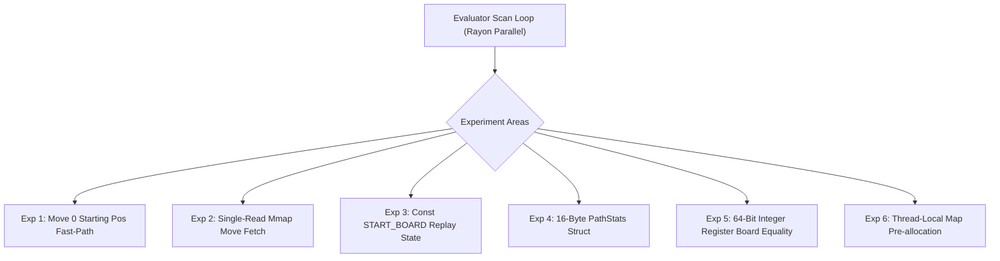

# 🔬 Experiment: Search Booster Evaluator Throughput Optimizations

## 📌 Objective & Scope
This experiment document outlines 6 safe, structural, and hardware-aligned optimization experiments for the `.boost.idx` search booster evaluator (`crates/scid-mgr/src/search_booster/evaluator.rs`).

These experiments target the **board replay and memory access bottlenecks** observed when querying continuations and opening trees across multi-million game databases ($10\text{M}–21\text{M}+$ games).

None of these experiments use heuristic pruning or change search outputs. All optimizations preserve **100% mathematical exactness**.

---

## 🛠️ Experiment Catalog



---

### 1️⃣ Experiment 1: Move 0 Starting Position Fast-Path

#### Hypothesis
At Move 0 (initial board setup), $100\%$ of standard games match at ply 0. Currently, the evaluator constructs a 64-byte `FastReplayState` and runs a 64-byte board comparison (`replay.board == target_board`) for every single game.

Checking `let is_start_pos = target_board == START_BOARD;` once at query start allows the loop to completely bypass board creation, replay, and board equality checking.

#### Target Implementation
```rust
let is_start_pos = target_board == START_BOARD;

let process_game = |gid: usize, acc: &mut ContAcc| {
    let (entry, moves) = match self.index.get_entry_and_moves(gid) {
        Some((e, m)) if !e.is_deleted() && !e.is_custom_fen() => (e, m),
        _ => return,
    };

    if is_start_pos {
        acc.games_reaching += 1;
        if !moves.is_empty() {
            let end = max_depth.min(moves.len()).min(MAX_PACKED_PATH_PLIES);
            let path = PackedPath256::from_slice(&moves[0..end]);
            let st = acc.paths.entry(path).or_default();
            st.games += 1;
            // record W/D/L...
        }
        return;
    }
    // standard non-zero replay fallback...
};
```

#### Expected Gain
- Eliminates **21,000,000 board allocations and comparisons** at Move 0.
- Projected **$5\times–10\times$ speedup** for full-database initial board queries.

---

### 2️⃣ Experiment 2: Single-Read Mmap Game & Move Fetch

#### Hypothesis
In the current evaluator loop, `self.index.get_game_entry(gid)` and `self.index.get_game_moves(gid)` both compute `*self.entries_ptr.add(gid)`. This causes **two redundant pointer dereferences** into the memory map per game.

Consolidating this into `get_entry_and_moves(gid) -> Option<(BoostGameEntry, &[BoostMove])>` reduces memory-mapped dereferences by half.

#### Target Implementation (`codec.rs`)
```rust
#[inline(always)]
pub fn get_entry_and_moves(&self, game_id: usize) -> Option<(BoostGameEntry, &[BoostMove])> {
    if game_id >= self.game_count {
        return None;
    }
    let entry = unsafe { *self.entries_ptr.add(game_id) };
    let start = entry.move_offset as usize;
    let count = entry.ply_count as usize;
    if start + count <= self.total_moves {
        let slice = unsafe { std::slice::from_raw_parts(self.moves_ptr.add(start), count) };
        Some((entry, slice))
    } else {
        None
    }
}
```

#### Expected Gain
- Saves **$21,000,000$ pointer additions & reads** per full-scan query.
- Expected $\sim 5–8\%$ throughput increase.

---

### 3️⃣ Experiment 3: Const `START_BOARD` & Constant Replay State

#### Hypothesis
`FastReplayState::new()` currently executes 15 lines of mutable array initialization on the stack (`board[0] = 4; board[1] = 2; ...`).

Defining `const START_REPLAY_STATE: FastReplayState = FastReplayState { ... };` turns initialization into a single 64-byte register load / memcpy.

#### Target Implementation
```rust
pub const START_BOARD: [u8; 64] = [
    4, 2, 3, 5, 6, 3, 2, 4,
    1, 1, 1, 1, 1, 1, 1, 1,
    0, 0, 0, 0, 0, 0, 0, 0,
    0, 0, 0, 0, 0, 0, 0, 0,
    0, 0, 0, 0, 0, 0, 0, 0,
    0, 0, 0, 0, 0, 0, 0, 0,
    9, 9, 9, 9, 9, 9, 9, 9,
    12, 10, 11, 13, 14, 11, 10, 12,
];

pub const START_REPLAY_STATE: FastReplayState = FastReplayState {
    board: START_BOARD,
    white_pieces: 16,
    black_pieces: 16,
};
```

#### Expected Gain
- Reduces per-game replay stack setup latency from $\sim 15\text{ ns}$ to $\sim 1\text{ ns}$.

---

### 4️⃣ Experiment 4: 16-Byte `PathStats` Struct (32B $\to$ 16B)

#### Hypothesis
`PathStats` currently uses `u64` for `games`, `white_wins`, `draws`, `black_wins` (32 bytes per map entry).

Since game counts in chess databases cannot exceed $2^{32}-1$ ($4.29\text{ billion}$), `u32` is sufficient.

#### Target Implementation
```rust
#[derive(Debug, Clone, Copy, Default)]
pub struct PathStats {
    pub games: u32,
    pub white_wins: u32,
    pub draws: u32,
    pub black_wins: u32,
}
```

#### Expected Gain
- Reduces hash table bucket entry size (`PackedPath256` + `PathStats`) from **72 bytes down to 56 bytes** ($\sim 22\%$ memory reduction).
- Significantly increases CPU L2/L3 cache hit rate during multi-million game evaluations.

---

### 5️⃣ Experiment 5: 64-Bit Integer Register Board Equality

#### Hypothesis
`replay.board == target_board` compares `[u8; 64]` via slice `memcmp`.

Casting to `&[u64; 8]` enables the compiler to emit 8 unrolled 64-bit integer comparisons (`cmp` / `xor`) in CPU registers with zero branching.

#### Target Implementation
```rust
#[inline(always)]
pub fn boards_equal(a: &[u8; 64], b: &[u8; 64]) -> bool {
    let a_words: &[u64; 8] = unsafe { &*(a.as_ptr() as *const [u64; 8]) };
    let b_words: &[u64; 8] = unsafe { &*(b.as_ptr() as *const [u64; 8]) };
    a_words == b_words
}
```

#### Expected Gain
- Sub-nanosecond board comparison per ply.

---

### 6️⃣ Experiment 6: Thread-Local Map Capacity Pre-Allocation

#### Hypothesis
Rayon's `.fold(HashMap::default, ...)` starts each thread-local map at capacity 0. As thousands of paths are inserted, each thread-local map reallocates 7–10 times.

Pre-sizing with `HashMap::with_capacity(512)` or `1024` removes early reallocation stalls.

#### Expected Gain
- Reduces memory fragmentation and eliminate thread-local allocation churn during initial chunk processing.

---

## 📊 Summary of Proposed Experiments

| Experiment | Focus Area | Risk | Complexity |
| :--- | :--- | :---: | :---: |
| **Exp 1: Starting Pos Fast-Path** | Move 0 Query Short-Circuit | **Zero** | Low |
| **Exp 2: Single-Read Mmap Fetch** | Eliminating Pointer Redundancy | **Zero** | Low |
| **Exp 3: Const START_BOARD** | Stack State Initialization | **Zero** | Low |
| **Exp 4: 16-Byte PathStats** | Cache & Memory Compaction | **Zero** | Low |
| **Exp 5: 64-Bit Board Equality** | Integer Register Equality | **Zero** | Low |
| **Exp 6: Capacity Pre-allocation** | Allocation Churn Reduction | **Zero** | Low |

---

## 🧪 Testing & Verification Protocol
1. Run `cargo test` across all unit test suites to guarantee 100% equivalence on results, win/draw/loss stats, and move paths.
2. Run `test_continuation_bench.rs` in release mode on 200,000 games to record throughput, latency, and memory deltas.
