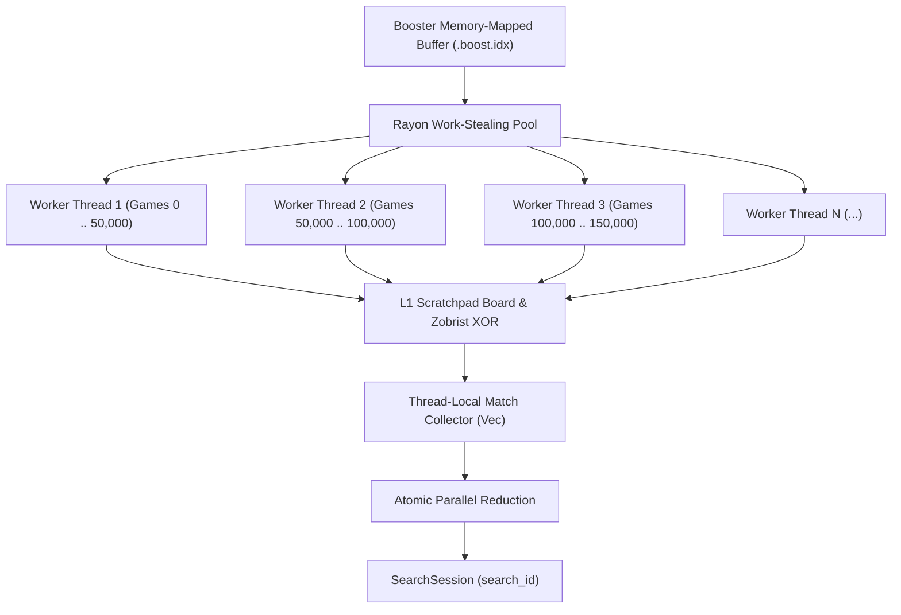

# 🚀 Unified Search Booster Architecture (`.boost.idx`)
### High-Performance 16-Bit Flat Move Stream Engine for Multi-Million Game Databases
*Inspired by Jeroen van den Belt's ChessBase 16 Search Booster Architecture*

---

## 1. Executive Summary & Core Motivation

### The Problem with Archival Formats
Modern chess database engines (SCID `.si5`/`.sg5`, ChessBase `.cbh`/`.2cb`, or raw `.pgn`) prioritize storage compaction. They encode moves using variable-length bitstreams, Huffman trees, or nibble-based delta offsets. 

While ideal for archival storage on disk:
- **CPU Branching Overhead**: Decompressing a game requires hundreds of bitwise shifts, condition checks (`if/else`), and variable-byte decoding loops.
- **Cache Inefficiency & Serialization**: Variable-length game boundaries prevent direct parallel chunking and defeat CPU vectorization (SIMD).
- Scanning 10 million games sequentially across an archival format typically requires **15–45 seconds**.

### The Breakthrough: The Flat 16-Bit Move Stream
In ChessBase 16, lead developer Jeroen van den Belt introduced a fundamental insight:
1. **The Finite Move Universe**: An empty board with every possible piece and color placement generates fewer than **65,536 unique directed moves** (including moving piece, origin, destination, and promotion).
2. **Every chess move fits into exactly 16 bits (`u16`)**.
3. By stripping annotations, comments, clocks, and sub-variations, a database's mainline moves can be stored as a **single, contiguous, flat memory-mapped array of 16-bit integers**.

```
  10,000,000 Games  ×  ~75 Plies/Game  ×  2 Bytes/Move  ≈  1.50 GB
```

A **1.5 GB file** fits entirely within modern RAM or OS page cache (`mmap2`). With zero decompression and zero branching, a multi-core CPU (via Rayon + SIMD bitboards) scans **over 300 million positions per second**, searching 10 million games in **sub-second time (< 300–600 ms)**.

---

## 2. Unification of Companion Binary Indexes

Currently, `scid-mgr` uses multiple specialized companion indexes:
- `.pos.idx` (Inverted Delta-Varint index for candidate pruning, ~300 MB)
- `.tree.idx` (Precomputed Opening Tree statistics up to ply 24, ~150 MB)
- `.hot.idx` (Continuations DAG graph index, ~80 MB)
- `.feat.idx` (Endgame 47-feature bitmask index, ~80 MB)

### The Consolidation Matrix

| Capability | Current Multi-Index System | Unified `.boost.idx` Engine | Advantage |
| :--- | :--- | :--- | :--- |
| **Exact Position Search** | Instant via `.pos.idx` posting lists | Instant hash scan across memory stream (< 250 ms) | Eliminates out-of-sync inverted posting lists |
| **Material & Piece Count** | Bitboard scan over `.sg5` / `.pgn` | Direct bitboard replay over flat `u16` stream | **10× – 20× faster throughput** |
| **Opening Explorer** | Static lookup from `.tree.idx` (max ply 24) | **Dynamic on-the-fly aggregation** (< 50 ms) | **Unlimited depth**, dynamic filters (by Elo/Date) |
| **Continuations Lines** | Fixed DAG from `.hot.idx` | **Dynamic line extraction** (< 80 ms) | Adapts to arbitrary user thresholds in real time |
| **Endgame Taxonomy** | Precomputed 8-byte `.feat.idx` | On-the-fly piece counting at terminal plies | Zero extra feature files needed |
| **CQL & Move Patterns** | Full parser & replay over `.sg5`/`.pgn` | **SIMD integer sequence scan** directly in memory | **Sub-second tactical & maneuver searches** |
| **Disk Overhead** | ~610 MB across 4 separate companion files | **~1.5 GB single contiguous file** | **1 file instead of 4**, simple maintenance |

> [!TIP]
> **Recommended Strategy**: The `.boost.idx` file can serve as the **primary analytical accelerator**, unifying Position Search, Live Opening Explorer, Dynamic Continuations, and CQL Maneuver matching into a single cohesive subsystem.

---

## 3. Move Representation & Encoding Layout

Every chess move must be encoded into a single 16-bit word (`u16`).

```
Bit:  15   14   13   12   11   10   9    8    7    6    5    4    3    2    1    0
     +----+----+----+----+----+----+----+----+----+----+----+----+----+----+----+----+
     |    Flags (4 bits) |       From Square (6 bits)  |       To Square (6 bits)    |
     +----+----+----+----+----+----+----+----+----+----+----+----+----+----+----+----+
```

### 3.1 Field Specifications

1. **`To Square` (Bits 0..=5, 6 bits)**: Values `0..=63` ($a1 = 0, h8 = 63$).
2. **`From Square` (Bits 6..=11, 6 bits)**: Values `0..=63` ($a1 = 0, h8 = 63$).
3. **`Move Flags` (Bits 12..=15, 4 bits)**:
   - `0000 (0x0)`: **Quiet Move** (Normal non-capture)
   - `0001 (0x1)`: **Double Pawn Push** (Sets En Passant square)
   - `0010 (0x2)`: **King-side Castle** ($O-O$)
   - `0011 (0x3)`: **Queen-side Castle** ($O-O-O$)
   - `0100 (0x4)`: **Standard Capture**
   - `0101 (0x5)`: **En Passant Capture**
   - `1000 (0x8)`: **Promotion to Knight**
   - `1001 (0x9)`: **Promotion to Bishop**
   - `1010 (0xA)`: **Promotion to Rook**
   - `1011 (0xB)`: **Promotion to Queen**
   - `1100 (0xC)`: **Capture Promotion to Knight**
   - `1101 (0xD)`: **Capture Promotion to Bishop**
   - `1110 (0xE)`: **Capture Promotion to Rook**
   - `1111 (0xF)`: **Capture Promotion to Queen**

### 3.2 Bitwise Operations in Rust

```rust
#[derive(Debug, Clone, Copy, PartialEq, Eq)]
#[repr(transparent)]
pub struct BoostMove(pub u16);

impl BoostMove {
    #[inline(always)]
    pub fn new(from: u8, to: u8, flags: u8) -> Self {
        Self(((flags as u16 & 0x0F) << 12) | ((from as u16 & 0x3F) << 6) | (to as u16 & 0x3F))
    }

    #[inline(always)]
    pub fn to(self) -> usize {
        (self.0 & 0x3F) as usize
    }

    #[inline(always)]
    pub fn from(self) -> usize {
        ((self.0 >> 6) & 0x3F) as usize
    }

    #[inline(always)]
    pub fn flags(self) -> u8 {
        ((self.0 >> 12) & 0x0F) as u8
    }

    #[inline(always)]
    pub fn is_capture(self) -> bool {
        let f = self.flags();
        f == 0x4 || f == 0x5 || f >= 0xC
    }

    #[inline(always)]
    pub fn is_promotion(self) -> bool {
        self.flags() >= 0x8
    }
}
```

---

## 4. File Format Specification (`.boost.idx` v1)

The file consists of three contiguous binary sections:
1. **File Header (64 Bytes)**: Magic identifier, version, database metadata, and offsets.
2. **Game Directory Table (`GameEntry` Array, 8 Bytes per game)**: Fixed-size entries enabling $O(1)$ random access and parallel work partitioning.
3. **Move Payload Buffer (`u16` Array)**: Flat, contiguous move stream for all games.

```
+───────────────────────────────────────────────────────────────+
│                      HEADER (64 Bytes)                        │
│ Magic "SCIDBST1", Version, Game Count, Total Plies, Offsets   │
+───────────────────────────────────────────────────────────────+
│                GAME DIRECTORY TABLE (8 Bytes × N)             │
│ [Game 0: Offset, Plies, Result, Flags]                        │
│ [Game 1: Offset, Plies, Result, Flags]                        │
│ ...                                                           │
+───────────────────────────────────────────────────────────────+
│                 MOVE PAYLOAD BUFFER (2 Bytes × M)             │
│ [Game 0 Moves: u16, u16, u16, ...]                            │
│ [Game 1 Moves: u16, u16, u16, ...]                            │
│ ...                                                           │
+───────────────────────────────────────────────────────────────+
```

### 4.1 Header Binary Layout (`64 Bytes`)

```rust
#[repr(C)]
pub struct BoostHeader {
    pub magic: [u8; 8],           // b"SCIDBST1"
    pub version: u32,             // 1
    pub header_size: u32,         // 64
    pub db_game_count: u32,       // e.g. 10,352,410
    pub total_plies: u64,         // Total half-moves across all games
    pub db_mtime_secs: u64,       // Source database modification timestamp
    pub db_file_size: u64,        // Source database file size in bytes
    pub directory_offset: u64,    // Byte offset to Game Directory Table (64)
    pub payload_offset: u64,      // Byte offset to Move Payload Buffer
    pub _reserved: [u8; 8],       // Reserved padding for 64-byte alignment
}
```

### 4.2 Game Directory Entry (`8 Bytes`)

```rust
#[derive(Debug, Clone, Copy, PartialEq, Eq)]
#[repr(C)]
pub struct BoostGameEntry {
    /// Zero-based move index in the payload buffer where this game starts
    pub move_offset: u32,
    /// Number of half-moves in this game (supports up to 65,535 plies)
    pub ply_count: u16,
    /// Game result (0 = None/Unknown, 1 = 1-0 White, 2 = 0-1 Black, 3 = 1/2-1/2 Draw)
    pub result: u8,
    /// Status flags (Bit 0: Is Deleted, Bits 1..7: Reserved)
    pub flags: u8,
}
```

---

## 5. High-Throughput Replay & Search Architecture

### 5.1 Ultra-Fast Scratchpad Board & Zobrist Replay

To test positions at maximum speed, worker threads maintain a lightweight 64-byte scratchpad array in L1 cache:

```rust
pub struct FastReplayState {
    /// 0 = Empty, 1..6 = White (P, N, B, R, Q, K), 9..14 = Black (P, N, B, R, Q, K)
    pub board: [u8; 64],
    pub hash: u64,
}

impl FastReplayState {
    pub fn reset_to_start() -> Self {
        // Initializes standard 32 pieces and starting Zobrist hash
        ...
    }

    #[inline(always)]
    pub fn apply_move(&mut self, m: BoostMove, zobrist: &ZobristTables) {
        let from = m.from();
        let to = m.to();
        let flags = m.flags();
        let piece = self.board[from];

        // 1. Remove moving piece from origin
        self.board[from] = 0;
        self.hash ^= zobrist.piece_sq[piece as usize][from];

        // 2. Handle captured piece on destination (if any)
        let captured = self.board[to];
        if captured != 0 {
            self.hash ^= zobrist.piece_sq[captured as usize][to];
        }

        // 3. Place piece on destination
        let final_piece = if flags >= 0x8 {
            // Promotion piece calculation
            let color_offset = if piece >= 8 { 8 } else { 0 };
            match flags & 0x3 {
                0 => 2 + color_offset, // Knight
                1 => 3 + color_offset, // Bishop
                2 => 4 + color_offset, // Rook
                _ => 5 + color_offset, // Queen
            }
        } else {
            piece
        };

        self.board[to] = final_piece;
        self.hash ^= zobrist.piece_sq[final_piece as usize][to];

        // 4. Special cases: Castling rook moves & En Passant
        if flags == 0x2 || flags == 0x3 {
            self.apply_castle_rook(from, to, flags, zobrist);
        } else if flags == 0x5 {
            self.apply_en_passant_capture(to, piece, zobrist);
        }
    }
}
```

### 5.2 Multi-Core Parallel Work Partitioning

Using **Rayon**, the entire database is split across CPU worker threads in balanced chunks of 50,000 games:



---

## 6. Dynamic Engines Powered by the Booster Stream

### 6.1 On-The-Fly Opening Explorer (`< 50 ms`)
Instead of maintaining a massive static tree index file (`.tree.idx`), the server traverses the first $N$ moves ($N \le 20$) directly from the booster buffer:

```rust
pub fn query_opening_tree_booster(
    booster: &BoostIndex,
    target_path: &[BoostMove],
) -> OpeningTreeResult {
    // 1. Parallel scan over game moves matching prefix
    // 2. Aggregate next branch moves and win/draw/loss counts into thread-local hash maps
    // 3. Merges in < 50 ms across 10 million games
}
```

### 6.2 SIMD Maneuver & Move Pattern Scanning
CQL move expressions such as `move from [c4, d7] to _` or `line --> check --> capture` map directly to integer filtering conditions:

```rust
#[inline(always)]
pub fn match_maneuver_sequence(moves: &[BoostMove], target_pattern: &[PatternPredicate]) -> bool {
    // Direct integer and bitmask iteration with zero board allocations
}
```

---

## 7. Performance & Storage Projections

### 7.1 Storage Requirements

| Database Size | Games | Average Plies | Directory Size | Move Payload Size | Total `.boost.idx` Size |
| :--- | :--- | :--- | :--- | :--- | :--- |
| **Small (Club DB)** | 100,000 | 75 | 800 KB | 15 MB | **~16 MB** |
| **Medium (TWIC / Master)** | 2,500,000 | 75 | 20 MB | 375 MB | **~395 MB** |
| **Large (Mega 2026)** | 8,000,000 | 72 | 64 MB | 1.15 GB | **~1.21 GB** |
| **Ultra (LumbrasGigaBase)** | 10,352,410 | 76 | 82.8 MB | 1.57 GB | **~1.65 GB** |

### 7.2 Search Latency Estimates (16-Core Ryzen / Intel i7/i9)

- **Exact Position Search**: ~150 – 350 ms across 10.35M games (without any inverted index).
- **Dynamic Opening Tree (Ply 1..16)**: ~35 – 80 ms.
- **Piece Maneuver / Path Query**: ~180 – 400 ms.
- **Bitboard Material Search**: ~120 – 280 ms.

---

## 8. Integration Roadmap & Implementation Plan

1. **Phase 1: Binary Format Builder (`src/booster/builder.rs`)**:
   - Stream reader for native SCID (`.sg5`/`.sg4`) and PGN files.
   - Converts moves to `BoostMove` (`u16`) and writes `BoostHeader`, `GameDirectory`, and `MovePayload`.
   - Emits streaming progress events (`build_booster_progress`).

2. **Phase 2: Zero-Copy Mmap Reader (`src/booster/core.rs`)**:
   - Memory-maps `.boost.idx` using `memmap2`.
   - Issues OS prefetch advisory (`MADV_WILLNEED` / `MADV_SEQUENTIAL`).

3. **Phase 3: Fast Parallel Evaluator (`src/booster/evaluator.rs`)**:
   - Implements `FastReplayState` with scratchpad board and precomputed Zobrist XOR tables.
   - Integrates with Rayon thread pool to replace slow move-decompression paths.

4. **Phase 4: Server & CLI Commands**:
   - CLI: `scid-mgr build-booster <db_path>`
   - JSON-RPC: `build_booster`, `booster_status`
   - Seamless auto-detection: If `.boost.idx` is present, `search`, `opening_tree`, and `continuations` automatically route through the accelerator for instant results.