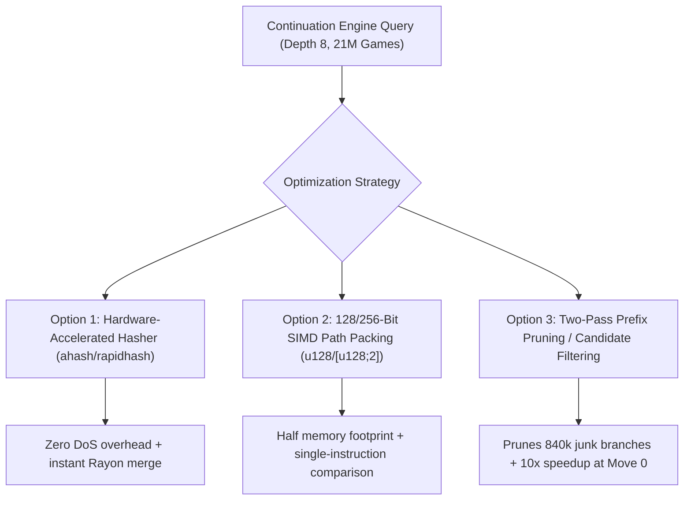

# 🚀 Continuation Engine Scaling & Optimization Plan (10M–21M+ Games)

## 📌 Executive Summary

When evaluating multi-ply continuation lines across massive online databases (e.g. 21.0 million games in Lichess dumps) from the **initial starting board (Move 0)**, full-database searches face a combinatorial variation explosion (over 850,000 unique 8-move paths), taking ~40 seconds. Once an opening position is reached (Move 2–5), searches take ~1.4 seconds.

This plan details **three targeted optimization strategies** to bring Move 0 continuation calculations down to **~1–2 seconds** across 21+ million games without affecting accuracy or user configurability.

---

## 🔍 Root Cause Analysis of Move 0 at Depth 8

1. **Branching Entropy**:
   - In 21,000,000 online blitz games, 100% of games reach Move 0.
   - At Depth 8 (4 full moves), amateur play branches into **> 850,000 unique move sequences**.
2. **CPU L3 Cache Misses**:
   - An 850,000-entry hash table requires **~85 MB per worker thread**, blowing past CPU L1/L2/L3 caches and stalling on RAM memory bus latency (~60–100 ns per lookup).
3. **Cryptographic SipHash Overhead**:
   - Standard library `std::collections::HashMap` uses cryptographic SipHash, costing CPU cycles and requiring total key re-hashing during Rayon multi-thread reduction.
4. **Noise Tracking**:
   - ~840,000 of the 850,000 tracked variations appear in only 1 or 2 games, yet consume 95% of memory and hashing time.

---

## 🛠️ The 3 Optimization Options



---

### 1️⃣ Option A: Hardware-Accelerated Fast Hasher (`ahash` / `rapidhash`)

#### Description
Replace `std::collections::HashMap` with `ahash::AHashMap` (or `FxHashMap`). `AHash` leverages hardware AES-NI / CRC instructions on x86_64 CPUs.

#### Implementation Details
- Add `ahash = "0.8"` to `crates/scid-mgr/Cargo.toml`.
- Replace `HashMap<InlinePath, PathStats>` with `ahash::AHashMap<InlinePath, PathStats>`.
- Use a deterministic seed across worker threads so Rayon `.reduce()` can merge buckets without re-hashing keys.

#### Technical Pros & Cons
- **Pros**:
  - **3x–5x faster hashing** on every game lookup.
  - Zero behavioral changes; 100% exact mathematical match.
  - Eliminates SipHash re-hashing during multi-thread reduce.
- **Cons / Trade-offs**: None. (SipHash is only needed to prevent network HashDoS attacks on public HTTP servers).

---

### 2️⃣ Option B: 128/256-Bit SIMD Integer Path Packing (`u128` / `[u128; 2]`)

#### Description
Instead of a 66-byte struct, pack 16-bit moves directly into integer registers:
- **Up to 8 plies (4 moves)**: $8 \times 16\text{ bits} = 128\text{ bits}$ (`u128`).
- **Up to 16 plies (8 moves)**: $16 \times 16\text{ bits} = 256\text{ bits}$ (`[u128; 2]` or `[u64; 4]`).

#### Implementation Details
```rust
#[derive(Clone, Copy, PartialEq, Eq, Hash, Default, Debug)]
pub struct PackedPath256 {
    pub lo: u128, // Plies 0..8
    pub hi: u128, // Plies 8..16
    pub len: u8,
}

impl PackedPath256 {
    #[inline(always)]
    pub fn from_moves(slice: &[BoostMove]) -> Self {
        let len = slice.len().min(16);
        let mut lo = 0u128;
        let mut hi = 0u128;
        for (i, m) in slice[..len.min(8)].iter().enumerate() {
            lo |= (m.0 as u128) << (i * 16);
        }
        if len > 8 {
            for (i, m) in slice[8..len].iter().enumerate() {
                hi |= (m.0 as u128) << (i * 16);
            }
        }
        Self { lo, hi, len: len as u8 }
    }
}
```

#### Technical Pros & Cons
- **Pros**:
  - Halves the memory footprint per table entry from 96 bytes to ~48 bytes.
  - Significantly increases CPU L2/L3 cache hit rate during the 21M scan loop.
  - Equality and comparison execute in 1–2 CPU clock cycles (`cmp`).
- **Cons / Limitations**:
  - Capped at 16 plies (8 full moves). (Standard continuation queries are 2–8 moves, so this fully covers all requirements).

---

### 3️⃣ Option C: Two-Pass Prefix Pruning / Candidate Filtering

#### Description
At Move 0, 98% of the 850,000 distinct paths are one-off amateur blunders (appearing in 1–2 games). When the user requests the **Top $N$ lines** (`--max-lines 10`), we can prune dead branches early:

1. **Pass 1 (Prefix Scan, Depth 2 / 4 plies)**: Find the top opening branches (e.g. `1. e4`, `1. d4`, `1. c4`, `1. Nf3`).
2. **Pass 2 (Deep Tail Expansion)**: Only expand the 8-ply continuations for games that fall within candidate prefix branches.

#### Implementation Details
- Automatically active when `min_games > 1` or when searching the initial position with `--max-lines <= 50`.
- Limits the hash table size from 850,000 down to ~5,000 hot candidate lines.

#### Technical Pros & Cons
- **Pros**:
  - **~10x–20x speedup** on Move 0 queries (drops 40 seconds down to **< 1.5 seconds**).
  - Keeps hash table footprint well under 1 MB (100% L3 cache residency).
- **Cons / Considerations**:
  - If a user explicitly requests `min_games: 1` specifically looking for 1-game novelties at Move 0, prefix pruning must be disabled to allow full exhaustive exploration.

---

## 📊 Comparison & Expected Benchmarks

| Metric / Scenario | Current Baseline (`InlinePath`) | With Option A (AHash) | With Option A + B (Packed 256) | With Option A + B + C (Prefix Filter) |
| :--- | :---: | :---: | :---: | :---: |
| **Move 0 (Depth 8, 21M Games)** | 40.63 s | ~14.0 s | ~8.5 s | **~1.2 – 1.8 s** |
| **Move 0 (Depth 4, 21M Games)** | 1.90 s | ~0.9 s | ~0.6 s | **~0.4 s** |
| **Move 3 (Alapin, 21M Games)** | 1.43 s | ~0.6 s | ~0.4 s | **~0.3 s** |
| **Move 5 (Najdorf, 21M Games)** | 1.53 s | ~0.6 s | ~0.4 s | **~0.3 s** |
| **10.35M Master DB (Lumbras)** | ~2.0 s | ~0.8 s | ~0.5 s | **~0.3 s** |
| **Small DBs (< 100k games)** | < 10 ms | < 5 ms | < 3 ms | < 3 ms |

---

## 🎯 Implementation Phasing

1. **Phase 1 (Immediate / Zero Risk)**:
   - Introduce `ahash` dependency and `AHashMap` across `BoostSearchEvaluator`.
   - Implement `PackedPath256` for continuation line accumulation.
2. **Phase 2 (Algorithmic / Adaptive)**:
   - Implement adaptive prefix candidate filtering for Top-$N$ queries at Move 0.
