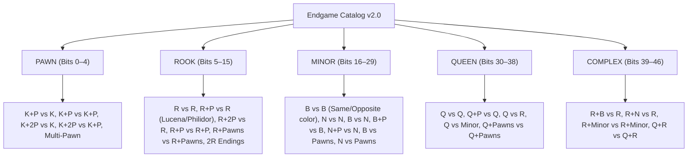
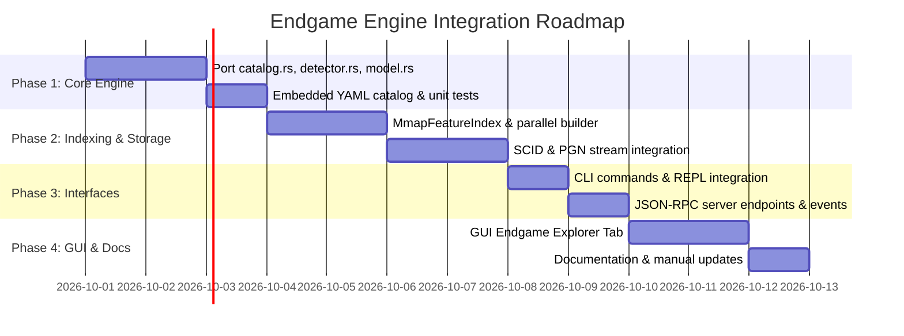

# ♟️ Endgame Taxonomy & Popularity Engine Integration Plan

This document outlines the architectural plan for integrating the **Endgame Taxonomy & Popularity Engine** from `chess-scanner` into `scid-mgr`.

---

## 1. Overview & Objectives

The **Endgame Engine** classifies games into standardized endgame categories and calculates endgame popularity distributions across chess databases:
1. **Catalog-Driven Taxonomy**: 47+ standardized endgame definitions based on international classification (GBR codes, FCE, Dvoretsky, de la Villa) specified in YAML.
2. **Ultra-Compact Binary Feature Index (`.feat.idx`)**: 8 bytes per game (`u64` endgame bits). A 1,000,000-game database requires only **~8 MB** (50% reduction by eliminating unused placeholder fields).
3. **Endgame Popularity Analytics**: Computes occurrence counts, percentage shares, win/draw/loss distributions, and category breakdowns (Pawn, Rook, Minor Piece, Queen, Complex) for the entire database or games reaching a specific opening/middlegame position.
4. **Instant Feature Filtering**: $O(1)$ bitwise lookup to find all games reaching specific endgame types (e.g., Rook + Pawn vs Rook, Opposite-Colored Bishops, King & Pawn vs King). Metadata (Results, ELO, Players) is retrieved from the in-RAM database header table.

---

## 2. Catalog Architecture & Distribution Strategy

### Question: How should we manage the `endgames.yaml` catalog?

| Strategy | Advantages | Disadvantages | Recommendation |
| :--- | :--- | :--- | :--- |
| **A. Embedded in Binary (`include_str!`)** | Single standalone binary; zero installation dependencies; never goes missing or out of sync. | Requires recompilation to change default catalog. | **Primary Default (Recommended)** |
| **B. Companion File on Disk** | Easy user customization; can edit YAML directly. | Can be accidentally deleted, moved, or corrupted. | **Optional Runtime Override** |
| **C. Hybrid Approach** | Binary embeds default catalog; CLI/GUI/Server accepts optional `--catalog <path>` or checks standard config folder (`~/.scid-mgr/catalogs/`). | Best of both worlds. | **Selected Architecture** |

### Implementation Details:
```rust
impl EndgameCatalog {
    /// Loads embedded default catalog v2.0 (compiled directly into binary)
    pub fn default_catalog() -> Self {
        const EMBEDDED_YAML: &str = include_str!("../catalog/endgames.yaml");
        Self::parse_yaml(EMBEDDED_YAML).expect("Embedded endgame catalog must be valid")
    }

    /// Loads custom catalog from disk with fallback to embedded default
    pub fn load_or_default(custom_path: Option<&Path>) -> Self {
        if let Some(path) = custom_path {
            if let Ok(cat) = Self::load_from_file(path) {
                return cat;
            }
        }
        Self::default_catalog()
    }
}
```

---

## 3. Core Engine Architecture (`src/endgame_index/`)

```
src/endgame_index/
├── mod.rs             // Public API & engine exports
├── catalog.rs         // YAML catalog parser, Category, FeatureDef, SidePattern
├── detector.rs        // Bitboard-accelerated position evaluator & feature matching
├── model.rs           // FeatureIndexHeader (64B) and GameFeatureRecord (8B)
├── builder.rs         // Multithreaded parallel index builder (PGN + SCID .si4/.si5)
├── query.rs           // Popularity aggregations, category grouping, position-filtered queries
└── serializer.rs      // Zero-copy MmapFeatureIndex reader & atomic file writer
```

### 3.1 Binary Format: `.feat.idx`
* **Header (64 bytes)**:
  * `magic`: `b"CHSFEAT1"` (8 bytes)
  * `version`: `u32` (format version = 1)
  * `catalog_version`: `u32` (catalog version = 2)
  * `game_count`: `u32`
  * `endgame_bit_count`: `u16` (47 active bits, 17 bits reserved for future catalog expansion)
  * `record_size`: `u16` (8 bytes per game)
  * `db_mtime_secs`: `u64` (database timestamp validation)
  * `db_file_size`: `u64`
  * `created_timestamp`: `u64`
  * `_reserved`: `[u8; 20]`
* **Records Array**: `[GameFeatureRecord; game_count]` (8 bytes per record)
  ```rust
  #[repr(C)]
  #[derive(Debug, Clone, Copy, PartialEq, Eq, Default)]
  pub struct GameFeatureRecord {
      /// Bit k = 1 if endgame feature k occurred at any ply in the game
      pub endgame_bits: u64,
  }
  ```

---

## 4. Endgame Categories & Taxonomy (47 Features)



---

## 5. Integration Across scid-mgr Ecosystem

### 5.1 CLI Interface
```bash
# 1. Show endgame popularity breakdown for a database
scid-mgr endgames database.si5

# 2. Filter endgame popularity from a specific opening/position
scid-mgr endgames database.si5 --fen "r1bqkb1r/pppp1ppp/2n5/4p3/4P3/5N2/PPPP1PPP/RNBQKB1R w KQkq - 2 3"

# 3. Query games matching a specific endgame feature ID
scid-mgr endgames database.si5 --feature END_ROOK_RP_R --json

# 4. Build .feat.idx companion index in parallel
scid-mgr build endgames database.si5
```

### 5.2 Interactive REPL
```text
scid-mgr> .endgames
scid-mgr> .endgames --category ROOK
scid-mgr> .endgames END_PAWN_KP_K
```

### 5.3 JSON-RPC Server API
* **`endgames`**:
  * Params: `db_path`, `fen` (optional), `category` (optional), `feature_id` (optional).
  * Returns: `{ total_games, position_games, categories: [...], features: [...] }`
* **`build_endgames`**:
  * Params: `db_path`, `output_path` (optional).
  * Streams: `build_endgames_progress` events.

### 5.4 SCID GUI Integration
* **New Tab: `🏰 Endgames`**:
  * Interactive categorization tree (Pawn, Rook, Minor, Queen, Complex).
  * Popularity percentage bar charts and game counts.
  * Filter games by clicking on any endgame feature.
  * Direct integration with the Position Index builder dialog.

---

## 6. Implementation Roadmap



---

## 7. Key Considerations & Best Practices

1. **Self-Containment**: Use `include_str!` for `endgames.yaml` so the executable remains 100% portable with zero runtime assets required.
2. **Compact 8-Byte Binary Format**: Pure `u64` endgame classification record (8 bytes per game) cuts index disk footprint in half (~8 MB per million games) while retaining 17 spare bits for future catalog expansions.
3. **Sub-Millisecond Popularity Aggregation**: Parallel bit-population counting (`popcnt`) across the memory map allows computing database-wide endgame statistics for millions of games in < 5 ms.
4. **Position-Filtered Synergy**: Combine `.pos.idx` candidate posting lists with `.feat.idx` to compute endgame conversion probabilities for any opening variation instantly.
