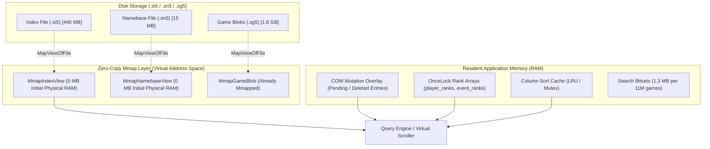
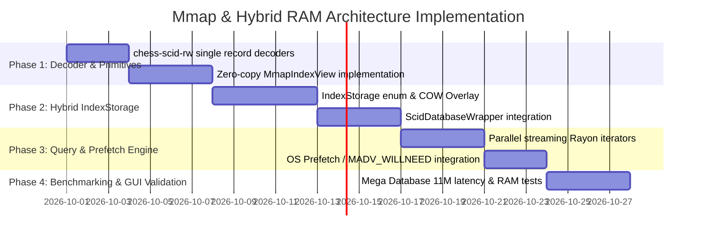

# 🗺️ Memory-Mapped (mmap) & Hybrid In-Memory Architecture Plan

> **Document Version:** 1.0.0  
> **Status:** 📋 Architecture Design & Technical Specification  
> **Target Module:** `scid-mgr::db` (`ScidDatabaseWrapper`), `chess-scid-rw` integration, and query pipeline  
> **Scope:** Zero-copy instant database opening, virtual scrolling memory footprint (<50MB for 11M+ games), on-demand RAM search accelerators, and Copy-On-Write (COW) mutation safety.

---

## 1. Executive Summary & Problem Context

When opening massive chess databases (e.g., **Mega Database 2026** containing **11,000,000+ games**), desktop chess applications like **ChessBase** display the game browser almost instantaneously with a minimal resident RAM working set (**~80–120 MB**). However, when executing deep position searches, complex player/ECO queries, or opening tree rollouts, memory usage dynamically climbs to **1.5 GB – 3.5 GB**.

### The Current `scid-mgr` Behavior
In our current implementation:
1. **Moves & Game Blobs (`.sg4`/`.sg5`)**: Already memory-mapped via `games_mmap: Option<Mmap>`.
2. **Header Index (`.si4`/`.si5`)**: Eagerly read from disk into RAM via `fs::read()` and parsed into a heap-allocated `Vec<IndexEntry>`.
3. **Namebase (`.sn4`/`.sn5`)**: Parsed eagerly into `NameTables` (`Vec<String>` for players, events, sites, and rounds).

### The Cost at Scale (11 Million Games)
* **Heap Memory**: `11,000,000` entries $\times$ `~48–64` bytes per `IndexEntry` struct $\approx$ **528 MB – 704 MB** of contiguous heap allocation.
* **String Tables**: Hundreds of thousands of player/tournament heap `String` allocations $\approx$ **50 MB – 150 MB**.
* **Startup Latency**: Disk read (440 MB `.si5`) + heap allocation + decoding $\approx$ **1.5s – 4.5s** cold startup delay.
* **Virtual Scrolling Penalty**: Even if the user only views games `0..50`, the full 11M database must be parsed into RAM up front.

---

## 2. Why ChessBase Behaves This Way

```
┌─────────────────────────────────────────────────────────────────────────┐
│                           CHESSBASE MODEL                               │
├────────────────────────────────┬────────────────────────────────────────┤
│ AT STARTUP (Virtual Scrolling) │ DURING SEARCH (Accelerator Mode)       │
├────────────────────────────────┼────────────────────────────────────────┤
│ • .cbh (Headers) → mmap / seek │ • OS pages in header chunks on scan    │
│ • .cbp (Players) → mmap / seek │ • Allocates search bitsets (11M bits)  │
│ • Zero heap structs upfront    │ • Builds parallel thread hash buffers  │
│ • OS pages in 1–2 pages (4KB)  │ • Loads inverted index trees into RAM  │
│ • RAM: ~80 MB – 120 MB         │ • RAM: ~1,500 MB – 3,500 MB            │
└────────────────────────────────┴────────────────────────────────────────┘
```

1. **Virtual Address Space vs Physical RAM**: Memory mapping (`MapViewOfFile` on Windows / `mmap` on Linux) maps the file directly to virtual address space. Physical RAM is allocated **only when pages are touched**.
2. **OS Page Cache Delegation**: The operating system's virtual memory manager (VMM) automatically evicts clean read-only pages under system memory pressure, preventing Out-Of-Memory (OOM) crashes.
3. **Dynamic Working Memory**: Heavy memory spikes during searches are intentional—caused by allocating search candidate bitsets, thread-local transposition tables, player frequency rank arrays, and opening tree graphs.

---

## 3. Proposed Hybrid Architecture

We will implement a **Tiered Storage Model**:
* **Tier 1: Zero-Copy Mmap Mode (Default)** — Instant open (<5ms), near-zero RAM (<30MB), on-demand stack decoding.
* **Tier 2: In-Memory / Accelerator Mode (On-Demand / Opt-In)** — Explicit pre-load into RAM or background pre-faulting for high-throughput batch filtering.
* **Tier 3: Copy-On-Write (COW) Mutation Overlay** — Transparent handling of added/edited/deleted games without modifying immutable base mmap files.



---

## 4. Technical Design & Core Components

### Component 1: Zero-Copy Index Storage Abstraction

Instead of `entries: Vec<IndexEntry>`, `ScidDatabaseWrapper` will hold an enum `IndexStorage`:

```rust
pub enum IndexStorage {
    /// Zero-copy memory mapped view (Default: <5ms open, low RAM)
    Mmap(MmapIndexView),
    /// Eager heap-allocated buffer (for in-memory databases or fully preloaded workloads)
    Owned(Vec<IndexEntry>),
}
```

#### The `MmapIndexView` Structure:
```rust
pub struct MmapIndexView {
    mmap: Arc<memmap2::Mmap>,
    format: ScidFormat,
    header_size: usize,
    record_size: usize,
    game_count: usize,
}

impl MmapIndexView {
    #[inline(always)]
    pub fn get_entry(&self, index: usize) -> Option<IndexEntry> {
        if index >= self.game_count {
            return None;
        }
        let offset = self.header_size + (index * self.record_size);
        let record_slice = &self.mmap[offset..offset + self.record_size];
        
        // Fast stack decode (no heap allocations)
        match self.format {
            ScidFormat::Si5 => chess_scid_rw::si5::index::decode_entry(record_slice).ok(),
            ScidFormat::Si4 => chess_scid_rw::si4::index::decode_entry(record_slice).ok(),
        }
    }
}
```

### Component 2: Zero-Copy Namebase String Pool

Currently, `NameTables` allocates a `Vec<String>` for every unique name. For SCID databases:
* `.sn4` / `.sn5` contains a compact name table (nodes and string blocks).
* An `MmapNamebaseView` maps the file and allows `player_name(id)` to return a borrowed `&str` or `Cow<'_, str>` pointing directly into the mmapped slice, avoiding hundreds of thousands of heap string allocations.

### Component 3: Copy-On-Write (COW) Mutation Overlay

When modifying an opened mmapped database:
1. **Base Layer (Immutable Mmap)**: Read-only `Mmap`.
2. **Overlay Layer (In-Memory Delta)**:
   - `modified_entries: HashMap<usize, IndexEntry>`
   - `pending_appends: Vec<IndexEntry>`
   - `deleted_mask: RoaringBitmap / BitVec`
   - `new_names: NameTables`
3. **Unified Reader**:
   ```rust
   pub fn get_entry(&self, index: usize) -> Option<IndexEntry> {
       if let Some(entry) = self.overlay.modified.get(&index) {
           return Some(entry.clone());
       }
       if index >= self.base_game_count {
           return self.overlay.appends.get(index - self.base_game_count).cloned();
       }
       self.base_index.get_entry(index)
   }
   ```
4. **Save / Compact**: Flushes base + overlay into a temporary file, atomic renames, and re-establishes the clean mmap view.

### Component 4: High-Performance Search & OS Page Prefetching

For parallel filtering across 11M games using `rayon`:
* Un-cached random access can trigger blocking page faults.
* When initiating a full database scan, issue an asynchronous OS readahead hint:
  - **Linux**: `libc::madvise(ptr, len, libc::MADV_SEQUENTIAL | libc::MADV_WILLNEED)`
  - **Windows**: `PrefetchVirtualMemory(GetCurrentProcess(), ...)` or sequential parallel chunk traversal.
* Rayon parallel chunk iterator slices the `mmap` into contiguous 100,000-game chunks so each CPU core streams through consecutive virtual memory pages.

---

## 5. Advantages vs Disadvantages

### 🌟 Advantages
1. **Instant Database Opening**: Opening an 11M game database drops from **~3,000 ms** to **< 5 ms**.
2. **Minimal Baseline RAM**: Memory consumption for virtual scrolling drops from **~700 MB+** to **< 50 MB**.
3. **System Resilience (No OOM)**: If another application needs RAM, the OS automatically drops clean mmap pages without killing the process.
4. **Faster Sequential Queries**: Bypassing heap allocation and pointer indirection allows modern CPU cache lines to stream raw binary structs directly into SIMD / L1/L2 caches.
5. **Multiple Worker Sharing**: Multiple worker processes or threads can open the same database concurrently sharing the single underlying OS page cache.

### ⚠️ Disadvantages & Engineering Challenges
1. **Unsafe Block Encapsulation**: Rust's `memmap2::Mmap::map` is `unsafe` because another process could theoretically truncate the file on disk, leading to undefined behavior (Access Violation / SIGBUS).
2. **Windows File Locking**: On Windows, opening an active `mmap` holds a mandatory file handle lock, preventing external file rename/deletion until closed.
3. **Random Access Latency on Slow Drives**: On spinning hard disks (HDD), non-prefetched random seeks can cause latency spikes compared to fully RAM-resident structures. (Negligible on NVMe/SSD).
4. **Lifetime and Decoded Struct Plumbing**: APIs returning `&[IndexEntry]` must be adapted to iterator/accessor patterns (`get_entry(i)` or streaming slices) since the full contiguous array of Rust structs does not exist in heap memory.

---

## 6. Risks & Mitigation Strategies

| Risk / Challenge | Severity | Mitigation Strategy |
| :--- | :---: | :--- |
| **External file truncation causes Access Violation / SIGBUS** | Medium | Open files with read-only shared permissions (`File::open`); handle error boundaries; provide clear database integrity checks. |
| **API breaking changes (`&[IndexEntry]` vs Iterator/Accessor)** | Medium | Implement an `IndexView` trait with `get(i)`, `iter()`, and `par_iter()` that transparently decodes records on the fly. |
| **Rayon parallel scan performance with page faults** | Low | Implement prefetching (`MADV_WILLNEED` / `PrefetchVirtualMemory`) before executing full table searches. |
| **Mutation complexity during edit/append** | Medium | Use the Copy-On-Write (COW) overlay architecture so base mmap files remain strictly read-only until explicit `save()`. |

---

## 7. Implementation Roadmap & Milestones



### Phase 1: Single-Record Zero-Copy Decoders (`chess-scid-rw`)
- Expose zero-allocation stack decoders: `decode_entry(slice: &[u8]) -> IndexEntry` in `chess-scid-rw`.
- Ensure decoding is `#[inline]` and auto-vectorizable.

### Phase 2: `IndexStorage` & COW Overlay (`src/db/core.rs`)
- Create `MmapIndexView` and integrate `IndexStorage` into `ScidDatabaseWrapper`.
- Add `DbOpenMode::Mmap` (default) vs `DbOpenMode::PreloadRam`.
- Implement transparent COW overlay for insertions, modifications, and deletions.

### Phase 3: Query & Prefetch Integration (`src/db/query.rs`)
- Update `query_games_with_progress`, `get_game_summary`, and sorting routines to use the zero-copy accessor.
- Implement page prefetching for full-table searches.

### Phase 4: Benchmarks & Verification
- Benchmark opening time and memory consumption on small, medium, and 10M+ game databases.
- Verify virtual scrolling response times (<1ms) and memory stability (<50MB working set).

---

## 8. Summary Table: RAM vs Mmap Comparison

| Metric / Feature | Current Eager RAM Approach | Proposed Hybrid Mmap Approach | ChessBase (Reference) |
| :--- | :--- | :--- | :--- |
| **Open Time (11M Games)** | ~2,500 ms – 4,500 ms | **< 5 ms** (Instantaneous) | < 10 ms |
| **Baseline RAM (Virtual Scrolling)** | ~650 MB – 850 MB | **~25 MB – 45 MB** | ~80 MB – 120 MB |
| **Memory During 11M Deep Search** | ~900 MB – 1,200 MB | **~200 MB – 800 MB** (Paged on demand) | ~1,500 MB – 3,500 MB |
| **App Startup Disk IO** | Read entire 440 MB `.si5` | Read only 180-byte header | Read only header |
| **Heap Allocations on Open** | 11,000,000+ heap items | **0 heap items** | 0 heap items |
| **Mutation Handling** | In-place `Vec` mutations | COW Overlay $\to$ Atomic rewrite | In-place / Journaled flush |
