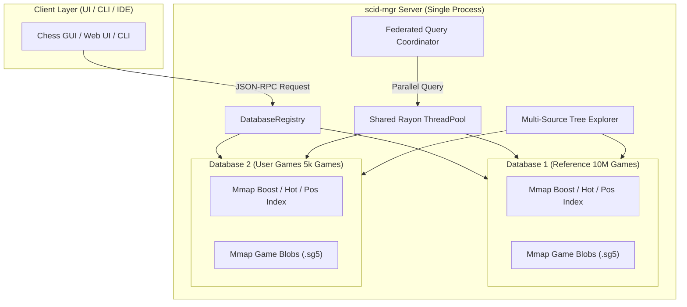

# 🏛️ Multi-Database Architecture, Federated Search & Zero-Copy Mmap Plan

> **Document Version:** 1.0.0  
> **Status:** 📋 Architectural Proposal & Technical Design  
> **Target Modules:** `scid-mgr::server`, `scid-mgr::db`, `scid-mgr::search_booster`, `scid-mgr::tree_index`, `scid-mgr::cli`  
> **Scope:** Multi-database lifecycle management, federated multi-database searches, multi-stream opening tree explorer, database merging/joining, and zero-copy header mmap integration.

---

## 1. Executive Summary: Does Handling Multiple Databases Make Sense?

**Yes, absolutely.** In modern chess software (such as **ChessBase**, **SCID vs. PC**, and **Lichess Explorer**), opening and querying multiple databases simultaneously is one of the most essential workflows.

### Primary Use Cases
1. **Reference + Personal Games Overlay (The "Explorer" Model)**:
   - Comparing Grandmaster theory from a 10M+ game Master Database with a player's personal games (e.g. "How do GMs play 3...Nf6 vs how often do I play it and what is my win rate?").
2. **Federated Multi-Database Search**:
   - Searching across multiple collections simultaneously (e.g., *Mega Database 2026*, *Lichess Blitz 2026*, *Tactics Repertoire*).
3. **Database Merging & Maintenance**:
   - Appending/copying games from newly downloaded PGN archives into a Master SCID database with automatic namebase remapping and deduplication.
4. **Isolated Repertoires (White vs Black)**:
   - Having separate repertoire databases open side-by-side.

---

## 2. Process Model: Single Binary vs. Multi-Process

### Option A: Spawning a Separate Binary per Database ❌
* **Heavy IPC Overhead**: Transferring millions of candidate game IDs, move trees, and game payloads over stdin/stdout pipes, sockets, or JSON-RPC causes massive serialization and context-switch bottlenecks.
* **CPU Core Contention**: Each process spawns its own Rayon thread pool (e.g. 16 threads $\times$ 3 processes = 48 threads on a 16-core CPU), causing thread thrashing and OS scheduler stalls.
* **Complex Lifecycle**: Managing orphan processes, deadlocks, and cross-process error propagation.

### Option B: Unified Single-Process Multi-Database Registry (Recommended) ✅
* **Zero Overhead**: Rayon thread pool is shared across all databases with 100% CPU efficiency.
* **Zero-Copy In-Memory Merging**: Merging and copying games happens direct memory-to-memory with SIMD speed.
* **Tiny RAM Working Set via Memory Mapping**: Because index records, companion booster files, and game blobs are all memory-mapped (`mmap`), **opening 2, 5, or 10 databases costs virtually 0 MB extra resident RAM**.



---

## 3. The Crucial Role of Memory-Mapped Headers (`IndexStorage::Mmap`)

Currently, `ScidDatabaseWrapper` and `PgnDatabaseWrapper` eagerly read index headers into heap `Vec<IndexEntry>`. For an 11-million game database, this allocates **~528 MB – 700 MB of heap RAM** and takes **1.5s – 3.0s** during cold startup.

By converting index headers to zero-copy memory maps:
- Opening any database takes **< 1 ms** regardless of database size (10,000 or 20,000,000 games).
- The operating system pages in only the 48-byte records touched by queries.
- **Multiple Databases Become Virtually Free**: Opening 10 large databases uses under **50 MB** of resident RAM working set.

---

## 4. Architectural Design & Implementation Plan

### 1. `DatabaseRegistry` in Server & Core Engine

Replace `current_db: Option<DatabaseBackend>` with a thread-safe registry:

```rust
pub struct DatabaseRegistry {
    databases: HashMap<String, Arc<DatabaseBackend>>,
    primary_db: Option<String>,
}

impl DatabaseRegistry {
    pub fn open(&mut self, alias: &str, path: &Path) -> Result<DatabaseInfo>;
    pub fn close(&mut self, alias: &str) -> Result<()>;
    pub fn get(&self, alias: &str) -> Option<Arc<DatabaseBackend>>;
    pub fn get_primary(&self) -> Option<Arc<DatabaseBackend>>;
    pub fn list(&self) -> Vec<DatabaseSummary>;
}
```

### 2. Backward-Compatible Server Protocol

Existing single-database commands remain identical by defaulting to `primary_db`:
- If `db` parameter is omitted: operates on the default/primary database.
- If `db: "user_games"` is provided: targets that specific database.
- If `dbs: ["master", "user_games"]` is provided: triggers federated multi-database execution.

```json
// Example: Querying opening tree overlay across both Master DB and User DB
{
  "command": "opening_tree",
  "params": {
    "fen": "r1bqkbnr/pppp1ppp/2n5/4p3/4P3/5N2/PPPP1PPP/RNBQKB1R w KQkq - 2 3",
    "dbs": ["master", "my_games"]
  }
}
```

### 3. Federated Search Engine

When a search runs across multiple databases:
1. The coordinator dispatches search tasks to the shared Rayon pool for each database in parallel.
2. Result sets are tagged with their source database:
   ```rust
   pub struct FederatedGameMatch {
       pub db_alias: String,
       pub game_id: usize,
       pub match_details: QueryMatchResult,
   }
   ```
3. Search sessions support paginating through combined or partitioned match lists.

### 4. Database Merging & Joining Tool (`merge_databases`)

A dedicated high-speed tool to merge Database A into Database B (or merge A + B into new C):
- **Stream Ingestion**: Reads game blobs directly from memory-mapped source without decoding SAN/PGN text unless re-encoding is needed.
- **Deduplication Engine**: Uses Zobrist hash signatures, player names, and normalized dates to skip duplicate games.
- **Batch Companion Index Rebuilding**: Automatically generates `.boost.idx`, `.pos.idx`, and `.hot.idx` for the merged destination database in a single pass.

---

## 5. Phased Roadmap

| Phase | Milestone | Key Deliverables |
| :---: | :--- | :--- |
| **Phase 1** | **Zero-Copy Header Mmap** | Convert `.si4`/`.si5` and `.pgn.idx` index arrays to `memmap2::Mmap` slice views. Opening any database drops from 2,000ms to <1ms with near-zero RAM footprint. |
| **Phase 2** | **Multi-DB Server Registry** | Implement `DatabaseRegistry` in `scid-mgr::server`. Support opening/closing named databases (`open_db`, `close_db`, `list_dbs`). Backward-compatible with single-DB clients. |
| **Phase 3** | **Federated Multi-DB Search** | Extend position search, CQL queries, and material searches to accept `dbs: [...]`. Execute queries in parallel across multiple databases. |
| **Phase 4** | **Multi-DB Opening Tree Overlay** | Support returning side-by-side or combined move statistics and win rates from multiple databases in `opening_tree` and `reference`. |
| **Phase 5** | **Database Merge & Join Command** | CLI and JSON-RPC command (`merge_databases` / `import_games`) with duplicate detection and fast companion index generation. |
